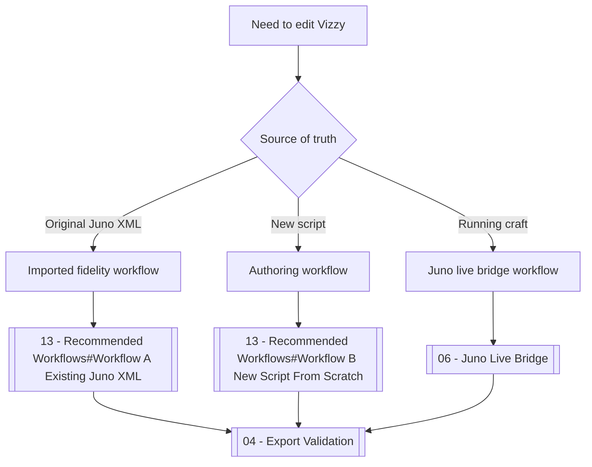

# VizzyCode Wiki Dashboard

VizzyCode is a Windows Forms, CLI, VS Code, and Juno live-bridge toolkit for converting and editing Vizzy programs from Juno: New Origins. This vault documents architecture, workflows, conversion fidelity, validation, raw preservation, live craft data, AI context, and troubleshooting. #vizzycode #dashboard

> [!info] Start here
> Use this page to choose the correct workflow: imported XML fidelity, new `.vizzy.cs` authoring, live Juno bridge work, VS Code integration, or AI-assisted repair.

> [!warning] Keep the workflow explicit
> `XML -> code -> XML` and `code -> XML` are different success criteria. Decide which one applies before editing a mission-scale file.

> [!tip] Fast route
> For practical work, start with [[13 - Recommended Workflows]], then use [[04 - Export Validation]], [[05 - Raw Preservation]], and [[14 - Troubleshooting]] as needed.

## Navigation Catalog

| Area             | Note                                           | Use it for                                              |
| ---------------- | ---------------------------------------------- | ------------------------------------------------------- |
| Home             | [[00 - Home]]                                  | Dashboard, Dataview panels, quick links                 |
| Architecture     | [[01 - Project Architecture]]                  | Component map, project layout, build commands           |
| Component map    | [[Component Map]]                              | Script-by-script project documentation                  |
| Converter        | [[02 - Conversion Engine (VizzyXmlConverter)]] | XML/code conversion, anchors, sidecar, Raw preservation |
| CLI              | [[03 - CLI (VizzyCode.Cli)]]                   | Import, export, roundtrip, raw encode/decode            |
| Validation       | [[04 - Export Validation]]                     | Juno-safe structural checks                             |
| Raw preservation | [[05 - Raw Preservation]]                      | `Raw*`, `RawXml*`, base64 payloads, exact XML fragments |
| Live bridge      | [[06 - Juno Live Bridge]]                      | Local HTTP bridge, endpoints, telemetry, snapshots      |
| VS Code          | [[07 - VS Code Extension]]                     | Commands, installation, generated artifacts             |
| AI               | [[08 - AI Integration]]                        | Provider commands, context bundles, repair prompts      |
| Juno mod         | [[09 - Juno Mod (Mod Assets)]]                 | Unity-side HTTP server and craft data                   |
| Authoring        | [[10 - Vizzy Authoring Guide]]                 | Safe `.vizzy.cs` syntax and unsafe patterns             |
| Blocks           | [[11 - Vizzy Blocks Reference]]                | Vizzy block families and special cases                  |
| Examples         | [[12 - Project Examples]]                      | Imported examples and sidecar pairs                     |
| Workflows        | [[13 - Recommended Workflows]]                 | Recommended step-by-step processes                      |
| Troubleshooting  | [[14 - Troubleshooting]]                       | Failure causes and fixes                                |
| Script catalog   | [[Script Catalog]]                             | Dataview catalog of component notes                     |
| Tags             | [[Tag Catalog]]                                | Dataview tag catalog                                    |
| Tag taxonomy     | [[Tag Taxonomy]]                               | Canonical tags for Tag Wrangler                         |
| Graph guide      | [[Graph View Guide]]                           | Rules for keeping Graph View clean                      |
| Plugin workflows | [[Obsidian Plugin Workflows]]                  | Advanced Tables, Dataview, Tag Wrangler usage           |
| Template         | [[Component Template]]                         | Component note template                                 |

## Section Map

> [!info] Core conversion
> [[01 - Project Architecture]] explains the component tree. [[02 - Conversion Engine (VizzyXmlConverter)]] explains the conversion engine, clean view, sidecars, and preservation anchors.

> [!tip] Daily workflow
> Use [[03 - CLI (VizzyCode.Cli)]] for repeatable commands and [[13 - Recommended Workflows]] for checklists that avoid mixing fidelity and authoring concerns.

> [!warning] Validation and exactness
> [[04 - Export Validation]] blocks known invalid XML shapes. [[05 - Raw Preservation]] explains exact XML fragments and when readable raw XML is preferable to rewriting.

> [!info] Live game work
> [[06 - Juno Live Bridge]] and [[09 - Juno Mod (Mod Assets)]] document the local bridge at `127.0.0.1:7842`.

> [!bug] Recovery path
> If Juno does not show a generated program, go to [[14 - Troubleshooting#Juno Does Not Load The XML]] and follow the validation, sidecar, and source-of-truth checks.

## Wiki Catalog

```dataview
TABLE type AS "Type", status AS "Status", file.tags AS "Tags"
FROM "VizzyCode"
SORT file.name ASC
```

## Open Tasks

```dataview
TASK
FROM "VizzyCode"
WHERE !completed
SORT file.name ASC
```

## Critical Concepts

| Concept | Short definition | Deep dive |
|---|---|---|
| `.vizzy.cs` | C#-style DSL used by VizzyCode. It is not normal project C#. | [[10 - Vizzy Authoring Guide#What Is The vizzy.cs DSL]] |
| `.vizzy.meta.json` | Sidecar that stores hidden fidelity metadata for clean-view imports. | [[02 - Conversion Engine (VizzyXmlConverter)#Clean View And Sidecar]] |
| `VZTOPBLOCK` | Preservation marker for a top-level imported block. | [[02 - Conversion Engine (VizzyXmlConverter)#Preservation Anchors]] |
| `VZBLOCK` | Base64 metadata marker for a top-level imported header. | [[02 - Conversion Engine (VizzyXmlConverter)#Preservation Anchors]] |
| `VZEL` | Base64 metadata marker for an imported element. | [[02 - Conversion Engine (VizzyXmlConverter)#Preservation Anchors]] |
| `RawXml*` | Readable escape hatch for exact XML fragments. | [[05 - Raw Preservation#Raw Forms Reference]] |
| `VZPOS` | Layout hint for top-level blocks in Juno. | [[02 - Conversion Engine (VizzyXmlConverter)#VZPOS Layout Hints]] |
| Export validation | Structural gate before saving XML. | [[04 - Export Validation#Validation Rules]] |

## Primary Workflow Map



## Quick Commands

> [!example] Build desktop app
> ```powershell
> dotnet build VizzyCode.csproj -c Release
> ```

> [!example] Import XML
> ```powershell
> dotnet run --project VizzyCode.Cli\VizzyCode.Cli.csproj -- import "input.xml" -o "output.vizzy.cs"
> ```

> [!example] Export with validation
> ```powershell
> dotnet run --project VizzyCode.Cli\VizzyCode.Cli.csproj -- export "input.vizzy.cs" -o "output.xml"
> ```

<details>
<summary>Recommended reading order</summary>

1. [[01 - Project Architecture]]
2. [[10 - Vizzy Authoring Guide]]
3. [[11 - Vizzy Blocks Reference]]
4. [[02 - Conversion Engine (VizzyXmlConverter)]]
5. [[04 - Export Validation]]
6. [[05 - Raw Preservation]]
7. [[06 - Juno Live Bridge]]
8. [[08 - AI Integration]]
9. [[14 - Troubleshooting]]

</details>

## Backlinks

Related overview notes: [[01 - Project Architecture]], [[03 - CLI (VizzyCode.Cli)]], [[07 - VS Code Extension]], [[08 - AI Integration]], [[13 - Recommended Workflows]].


