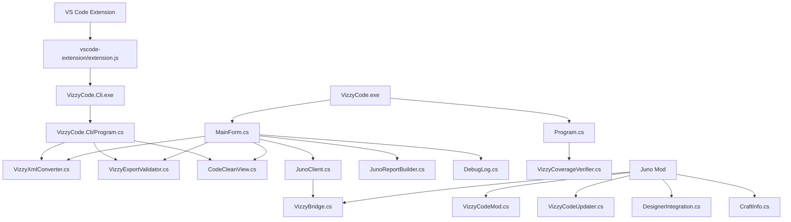
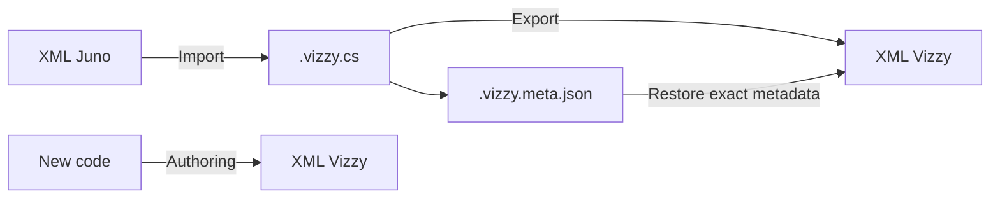

# Project Architecture

VizzyCode is a .NET Windows Forms application with a shared conversion engine, a standalone CLI, a VS Code extension, and an optional Unity mod that exposes live Juno data through a local HTTP bridge. #architecture #csproj

> [!info] Core idea
> The desktop app, CLI, and VS Code extension all depend on the same conversion and validation logic. This keeps `XML -> code -> XML` and `code -> XML` behavior consistent across tools.

> [!warning] Project file scope
> `VizzyCode.csproj` excludes generated output, test harnesses, the CLI project, examples, mod assets, `*.vizzy.cs`, and sidecars from desktop compilation. The `.vizzy.cs` files are converter inputs, not ordinary C# application source files.

## Component Tree



## Primary Flows



> [!tip] Workflow match
> Use [[13 - Recommended Workflows#Workflow A Existing Juno XML]] for imported programs and [[13 - Recommended Workflows#Workflow B New Script From Scratch]] for new scripts.

## Source File Reference

| File | Responsibility | Depends on |
|---|---|---|
| `Program.cs` | Entry point for UI, verification, and roundtrip test modes. | `MainForm`, `VizzyCoverageVerifier` |
| `MainForm.cs` | Main editor UI, toolbar, AI panel, import/export, bridge actions. | Converter, validator, clean view, bridge client |
| `MainForm.Designer.cs` | WinForms generated control layout. | Windows Forms |
| `VizzyXmlConverter.cs` | Core XML/code conversion engine. | XML LINQ, parser helpers |
| `VizzyExportValidator.cs` | Structural validation before saving XML. | XML LINQ |
| `VizzyCoverageVerifier.cs` | Repository verification over examples and supported exporter paths. | Converter, validator |
| `CodeCleanView.cs` | Clean-view generation and sidecar restoration. | Converter output conventions |
| `DebugLog.cs` | Internal diagnostic logging. | Runtime file/console APIs |
| `JunoClient.cs` | HTTP client for the Juno live bridge. | `HttpClient`, bridge endpoints |
| `JunoReportBuilder.cs` | Markdown reports from telemetry and craft snapshots. | Bridge JSON payloads |
| `VizzyCode.Cli/Program.cs` | CLI commands: import, export, roundtrip, raw tools. | Converter, clean view, validator |
| `Mod Assets/Scripts/VizzyCode/VizzyBridge.cs` | Unity-side HTTP bridge. | Juno ModApi, Unity runtime |
| `Mod Assets/Scripts/VizzyCode/VizzyCodeMod.cs` | Mod entry point and lifecycle. | Juno mod loader |
| `Mod Assets/Scripts/VizzyCode/VizzyCodeUpdater.cs` | Update loop support. | Unity runtime |
| `Mod Assets/Scripts/VizzyCode/DesignerIntegration.cs` | Designer integration for craft access and Vizzy program injection. | Juno designer APIs |
| `Mod Assets/Scripts/VizzyCode/CraftInfo.cs` | Craft, part, stage, and modifier serialization. | Juno craft data |

## Build Configuration

### Desktop app

```powershell
dotnet build VizzyCode.csproj -c Release
dotnet publish VizzyCode.csproj -c Release -r win-x64 -p:PublishSingleFile=true --self-contained true
```

### CLI

```powershell
dotnet build VizzyCode.Cli\VizzyCode.Cli.csproj -c Release
dotnet publish VizzyCode.Cli\VizzyCode.Cli.csproj -c Release -r win-x64 -p:PublishSingleFile=true --self-contained true -o publish_cli_win64
```

### VS Code integration

```powershell
.\scripts\install-vscode-integration.ps1
```

The integration script publishes the CLI, creates the extension distribution folder, packages a VSIX, and installs the extension. See [[07 - VS Code Extension#Installation]].

## Runtime Surfaces

| Surface | Main use | Related note |
|---|---|---|
| Desktop app | Interactive editing, import/export, AI chat, bridge actions. | [[00 - Home]] |
| CLI | Repeatable conversion and raw payload inspection. | [[03 - CLI (VizzyCode.Cli)]] |
| VS Code extension | Editor commands backed by the CLI. | [[07 - VS Code Extension]] |
| Juno mod | Local game-side bridge. | [[09 - Juno Mod (Mod Assets)]] |
| Coverage verifier | Broad repository checks. | [[04 - Export Validation#Coverage Verification]] |

<details>
<summary>Architecture checklist</summary>

- [ ] Identify which surface is being changed: app, CLI, extension, converter, validator, or mod.
- [ ] Decide whether the behavior affects fidelity, new authoring, or both.
- [ ] Keep `.vizzy.cs` examples out of normal compilation.
- [ ] Run export validation after conversion changes.
- [ ] Use [[12 - Project Examples]] to choose representative test files.

</details>

## Backlinks

Related notes: [[00 - Home]], [[02 - Conversion Engine (VizzyXmlConverter)]], [[03 - CLI (VizzyCode.Cli)]], [[06 - Juno Live Bridge]], [[07 - VS Code Extension]], [[09 - Juno Mod (Mod Assets)]].


