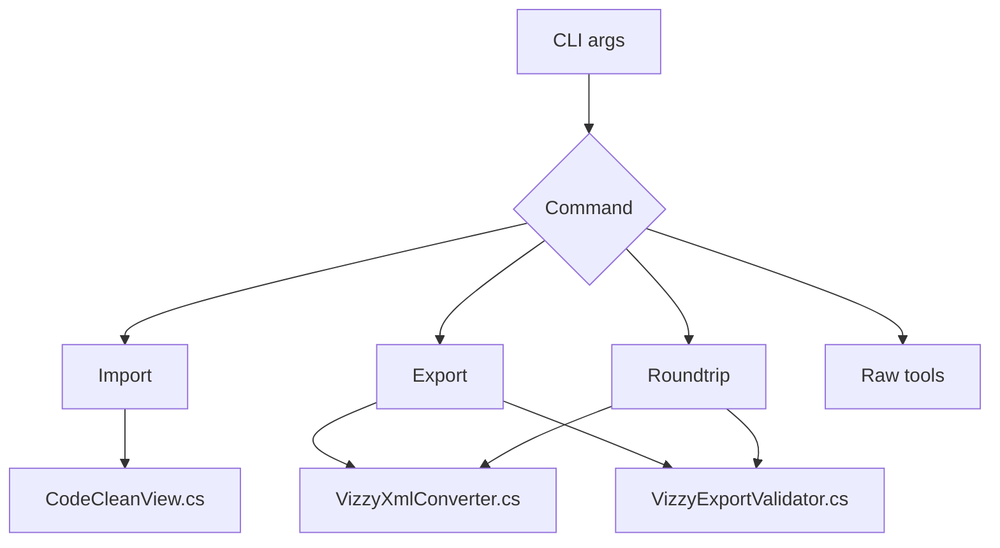

---
tags: [cli, commands, automation, script]
type: script
file: VizzyCode.Cli/Program.cs
related:
  - "[[03 - CLI (VizzyCode.Cli)]]"
  - "[[VizzyXmlConverter.cs]]"
  - "[[VizzyExportValidator.cs]]"
status: active
---

# CLI Program.cs

`VizzyCode.Cli/Program.cs` implements the standalone command-line interface. It is the automation layer used directly by users and indirectly by the VS Code extension. #cli #automation

## Commands Implemented

| Command | Method | Core behavior |
|---|---|---|
| `import` | `RunImport` | XML to clean-view `.vizzy.cs` plus sidecar. |
| `export` | `RunExport` | Restore sidecar, convert code, validate, save XML. |
| `roundtrip` | `RunRoundTrip` | XML to code to XML, then byte comparison. |
| `raw-encode` | `RunRawEncode` | XML element to `Raw*` and `RawXml*` forms. |
| `raw-decode` | `RunRawDecode` | Raw payload or call back to XML. |

## Dependency Flow

> [!danger] Export validation
> CLI export and roundtrip intentionally fail when [[VizzyExportValidator.cs]] reports errors.

## Backlinks

Related notes: [[Component Map]], [[03 - CLI (VizzyCode.Cli)]], [[07 - VS Code Extension]], [[13 - Recommended Workflows]].

