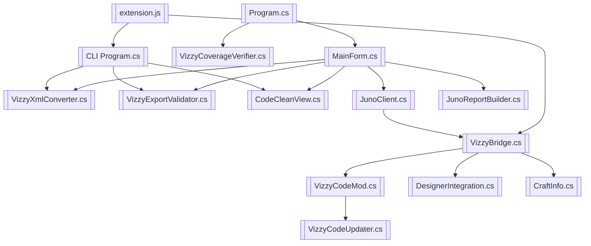

---
tags: [components, map, scripts, architecture]
type: component-map
related:
  - "[[01 - Project Architecture]]"
  - "[[02 - Conversion Engine (VizzyXmlConverter)]]"
  - "[[13 - Recommended Workflows]]"
  - "[[Script Catalog]]"
status: active
---

# Component Map

This map is the script-level navigation layer for VizzyCode. Each project script has its own explanatory note and links back into the larger workflows. #components #scripts

> [!info] Graph View purpose
> This page replaces vague hub names with explicit component nodes. Use it as the central graph node for project internals.

## Runtime Dependency Map

## Desktop App Scripts

| Script | Note | Responsibility |
|---|---|---|
| `Program.cs` | [[Program.cs]] | App entry point, verification mode, roundtrip test mode, UI startup. |
| `MainForm.cs` | [[MainForm.cs]] | Main WinForms UI, editor operations, bridge commands, save/export flow. |
| `MainForm.Designer.cs` | [[MainForm.Designer.cs]] | WinForms designer-generated layout and control declarations. |
| `DebugLog.cs` | [[DebugLog.cs]] | Internal diagnostics and logging support. |

## Conversion Core Scripts

| Script | Note | Responsibility |
|---|---|---|
| `VizzyXmlConverter.cs` | [[VizzyXmlConverter.cs]] | XML/code conversion engine. |
| `VizzyExportValidator.cs` | [[VizzyExportValidator.cs]] | Export-time structural validation. |
| `VizzyCoverageVerifier.cs` | [[VizzyCoverageVerifier.cs]] | Repository-wide conversion coverage checks. |
| `CodeCleanView.cs` | [[CodeCleanView.cs]] | Clean visible code and sidecar restoration. |
| `JunoClient.cs` | [[JunoClient.cs]] | Desktop bridge HTTP client. |
| `JunoReportBuilder.cs` | [[JunoReportBuilder.cs]] | Markdown report generation from bridge JSON. |

## CLI And Extension Scripts

| Script | Note | Responsibility |
|---|---|---|
| `VizzyCode.Cli/Program.cs` | [[CLI Program.cs]] | Command-line import/export/roundtrip/raw tooling. |
| `VizzyCode.Cli.csproj` | [[VizzyCode.Cli.csproj]] | CLI project configuration. |
| `extension.js` | [[extension.js]] | VS Code command implementation. |
| `package.json` | [[VS Code package.json]] | VS Code contribution and configuration metadata. |
| `vscode-extension/install.ps1` | [[vscode-extension install.ps1]] | Extension-side install helper. |

## Build Scripts And Project Files

| Script | Note | Responsibility |
|---|---|---|
| `VizzyCode.csproj` | [[VizzyCode.csproj]] | Desktop app project configuration. |
| `scripts/install-vscode-integration.ps1` | [[install-vscode-integration.ps1]] | End-to-end CLI publish and VSIX install workflow. |
| `_make_release_062.ps1` | [[make release script]] | Repository release helper script. |

## Juno Mod Scripts

| Script | Note | Responsibility |
|---|---|---|
| `VizzyBridge.cs` | [[VizzyBridge.cs]] | Local HTTP bridge server. |
| `VizzyCodeMod.cs` | [[VizzyCodeMod.cs]] | Unity mod entry point. |
| `VizzyCodeUpdater.cs` | [[VizzyCodeUpdater.cs]] | Mod update loop. |
| `DesignerIntegration.cs` | [[DesignerIntegration.cs]] | Designer-scene craft/Vizzy access. |
| `CraftInfo.cs` | [[CraftInfo.cs]] | Craft and part serialization model. |

## Imported Example Scripts

| Script | Note | Use |
|---|---|---|
| `Altair Alphard Vizzy.vizzy.cs` | [[Altair Alphard Vizzy.vizzy.cs]] | Imported example with sidecar. |
| `Altair Basic Function.vizzy.cs` | [[Altair Basic Function.vizzy.cs]] | Smaller custom/function example. |
| `MFD Default.vizzy.cs` | [[MFD Default.vizzy.cs]] | MFD/widget behavior example. |
| `T.T. Mission Program.vizzy.cs` | [[T.T. Mission Program.vizzy.cs]] | Mission-scale fidelity-sensitive example. |
| `Universal Vizzy Mission 2.vizzy.cs` | [[Universal Vizzy Mission 2.vizzy.cs]] | Larger universal mission example. |

## Backlinks

Related notes: [[00 - Home]], [[01 - Project Architecture]], [[02 - Conversion Engine (VizzyXmlConverter)]], [[12 - Project Examples]], [[13 - Recommended Workflows]], [[Script Catalog]].

