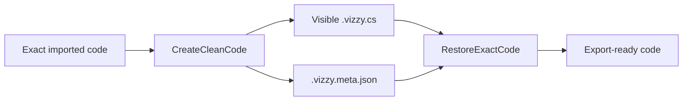

---
tags: [clean-view, sidecar, fidelity, script]
type: script
file: CodeCleanView.cs
related:
  - "[[VizzyXmlConverter.cs]]"
  - "[[05 - Raw Preservation]]"
  - "[[12 - Project Examples]]"
status: active
---

# CodeCleanView.cs

`CodeCleanView.cs` converts exact imported converter output into a cleaner visible `.vizzy.cs` file while storing hidden fidelity metadata in a `.vizzy.meta.json` sidecar. #clean-view #sidecar

## Responsibilities

| Area | Behavior |
|---|---|
| Clean creation | Hides `VZTOPBLOCK`, `VZBLOCK`, and `VZEL` metadata lines. |
| Line mapping | Stores clean line, exact line, and hidden metadata lines. |
| Sidecar paths | Maps `.vizzy.cs` to `.vizzy.meta.json`. |
| Sidecar I/O | Saves and loads sidecar JSON. |
| Restoration | Rebuilds export-ready exact code before conversion. |
| Simplification | Converts obvious `RawXml*` cases into plain visible syntax. |

## Clean View Flow

> [!danger] Sidecar importance
> For imported files, the sidecar is part of the fidelity mechanism. Keep it with the visible code file.

## Backlinks

Related notes: [[Component Map]], [[02 - Conversion Engine (VizzyXmlConverter)]], [[05 - Raw Preservation]], [[12 - Project Examples]].

