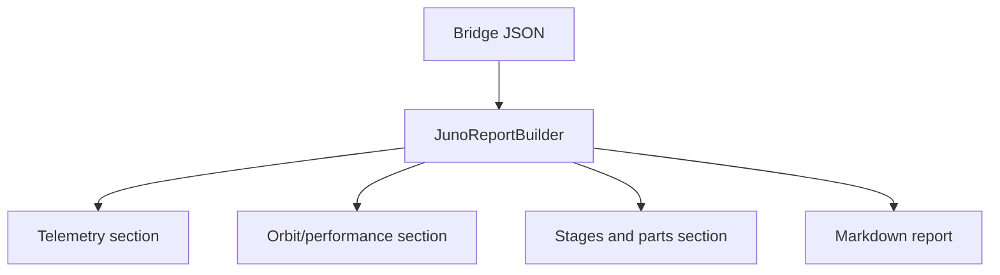

---
tags: [bridge, reports, ai, script]
type: script
file: JunoReportBuilder.cs
related:
  - "[[JunoClient.cs]]"
  - "[[08 - AI Integration]]"
  - "[[06 - Juno Live Bridge]]"
status: active
---

# JunoReportBuilder.cs

`JunoReportBuilder.cs` converts raw bridge JSON into readable Markdown reports for humans and AI agents. It is used by the desktop app report actions. #reports #ai

## Responsibilities

| Area | Behavior |
|---|---|
| Report entry point | Builds Markdown from snapshot or telemetry JSON. |
| Telemetry sections | Summarizes altitude, velocity, mass, fuel, orbit, performance, target, and quality. |
| Craft sections | Summarizes parts, stages, activation groups, Vizzy-capable parts, and practical roles. |
| Markdown safety | Formats values as tables and bullets. |
| AI context | Produces readable context bundles for [[08 - AI Integration]]. |

## Report Flow

## Backlinks

Related notes: [[Component Map]], [[JunoClient.cs]], [[06 - Juno Live Bridge]], [[08 - AI Integration]].

