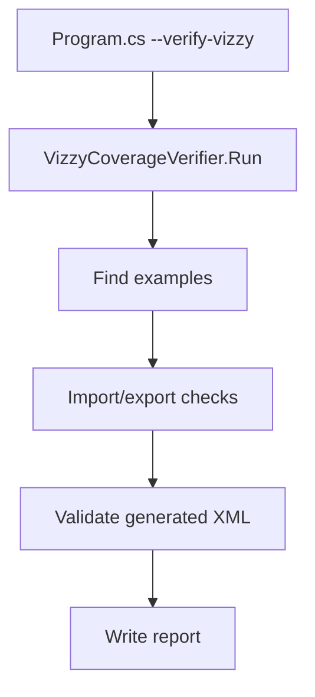

---
tags: [coverage, verification, examples, script]
type: script
file: VizzyCoverageVerifier.cs
related:
  - "[[Program.cs]]"
  - "[[VizzyXmlConverter.cs]]"
  - "[[VizzyExportValidator.cs]]"
status: active
---

# VizzyCoverageVerifier.cs

`VizzyCoverageVerifier.cs` runs repository-level conversion checks over supported examples and reports practical coverage. It is called by `Program.cs` in verification mode. #coverage #verification

## Responsibilities

| Area | Behavior |
|---|---|
| Example discovery | Finds XML and code examples in the repository. |
| Roundtrip checks | Imports XML and exports regenerated XML. |
| Export checks | Converts code samples to XML. |
| Validation checks | Runs [[VizzyExportValidator.cs]] over generated XML. |
| Report writing | Produces a text report for maintainers. |

## Verification Flow

## Backlinks

Related notes: [[Component Map]], [[04 - Export Validation]], [[12 - Project Examples]], [[14 - Troubleshooting]].

