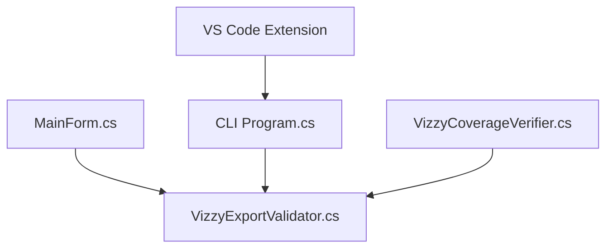

---
tags: [validation, xml, core, script]
type: script
file: VizzyExportValidator.cs
related:
  - "[[04 - Export Validation]]"
  - "[[VizzyXmlConverter.cs]]"
  - "[[CLI Program.cs]]"
status: active
---

# VizzyExportValidator.cs

`VizzyExportValidator.cs` is the structural safety gate for generated XML. It checks known Juno-breaking shapes before output is saved by the desktop app, CLI, or VS Code extension. #validation #xml

## Public API

| Member | Purpose |
|---|---|
| `Validate(XDocument doc)` | Returns a list of validation error strings. |
| `Format(IReadOnlyList<string> errors)` | Formats validation output for UI/CLI display. |
| `RequireAttr(...)` | Internal helper for required top-level attributes. |

## Checked Rules

| Rule family | Examples |
|---|---|
| Root structure | Root must be `<Program>`, with top-level `<Instructions>`. |
| Evaluate expressions | `style="evaluate-expression"` is required. |
| Else encoding | Raw `<Else>` is rejected; Juno-safe `ElseIf style="else"` is required. |
| Top-level metadata | `pos`, `event`, `callFormat`, `format`, `name`. |

## Call Sites

## Backlinks

Related notes: [[Component Map]], [[04 - Export Validation]], [[VizzyXmlConverter.cs]], [[14 - Troubleshooting]].

