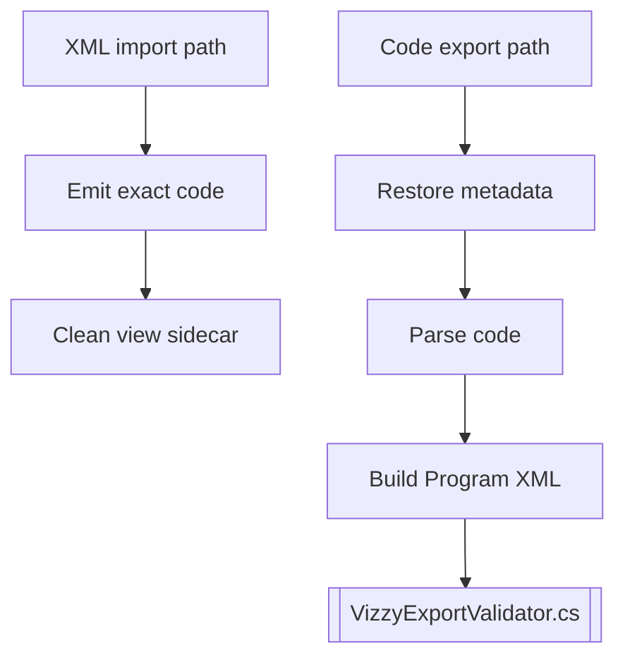

---
tags: [converter, core, xml, script]
type: script
file: VizzyXmlConverter.cs
related:
  - "[[02 - Conversion Engine (VizzyXmlConverter)]]"
  - "[[VizzyExportValidator.cs]]"
  - "[[CodeCleanView.cs]]"
status: active
---

# VizzyXmlConverter.cs

`VizzyXmlConverter.cs` is the main conversion engine script. It contains the importer from Vizzy XML to `.vizzy.cs`, the exporter from `.vizzy.cs` to XML, expression conversion, instruction conversion, preservation anchors, raw fragment decoding, and layout metadata handling. #converter #xml

> [!info] Deep reference
> The high-level guide is [[02 - Conversion Engine (VizzyXmlConverter)]]. This page focuses on the script as a maintainable source file.

## Major Areas

| Area | Examples |
|---|---|
| Public entry points | `ConvertCraftToCode`, `ConvertProgramToCode`, `ConvertCodeToXml`, `ConvertExpression`. |
| XML import emitters | Variables, custom instructions, events, instruction blocks, expressions. |
| Code export parser | Top-level blocks, variables, calls, expressions, raw preservation. |
| Preservation metadata | `VZTOPBLOCK`, `VZBLOCK`, `VZEL`, `RawXml*`, `Raw*`. |
| Layout metadata | `VZPOS` and generated positions. |
| Expression support | Math, craft properties, planet ops, strings, lists, vectors, custom expressions. |

## Internal Flow

## Maintenance Rules

> [!warning] Converter changes affect every surface
> Desktop app, CLI, and VS Code exports all depend on this script. Test both imported fidelity and fresh authoring paths.

> [!tip] Preferred verification
> Use [[VizzyCoverageVerifier.cs]], [[03 - CLI (VizzyCode.Cli)]], and [[12 - Project Examples]] after changing this file.

## Backlinks

Related notes: [[Component Map]], [[02 - Conversion Engine (VizzyXmlConverter)]], [[04 - Export Validation]], [[05 - Raw Preservation]].

