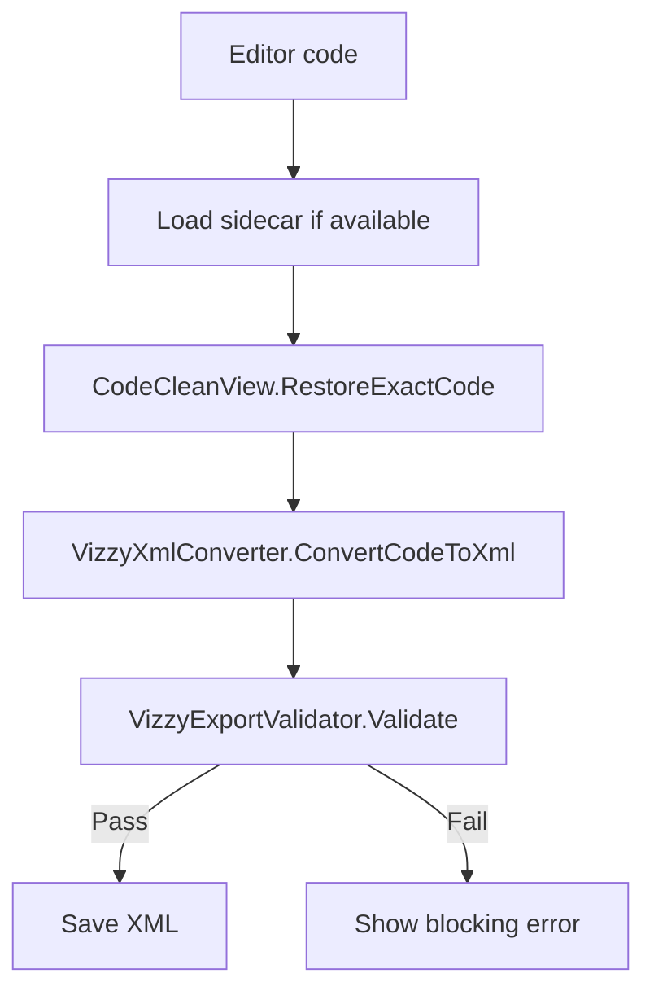
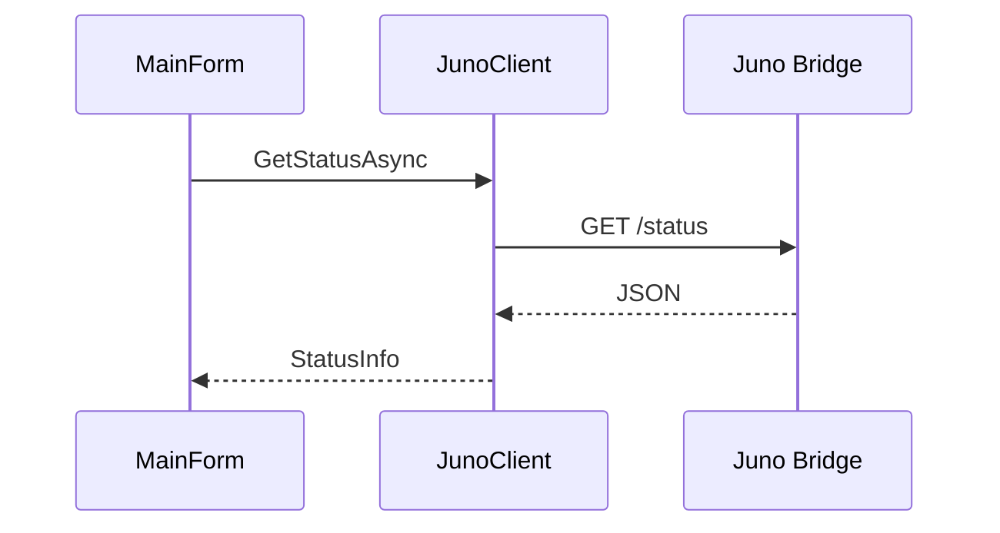

# MainForm.cs

`MainForm.cs` is the main Windows Forms UI and the highest-level orchestration point for editor actions, file loading, export validation, AI panel behavior, and Juno bridge commands. #desktop #ui

> [!info] Main role
> This script coordinates user actions. It should not be treated as the conversion source of truth; that belongs to [[VizzyXmlConverter.cs]] and [[VizzyExportValidator.cs]].

## Responsibilities

| Area | Behavior |
|---|---|
| File loading | Opens craft XML, Vizzy XML, and code files. |
| Code editor | Displays and highlights `.vizzy.cs`. |
| Save code | Writes current editor content. |
| Save XML | Restores sidecar metadata, converts code, validates XML, saves output. |
| Tree view | Displays parsed program structure. |
| Juno bridge | Connects, browses parts, imports/exports Vizzy, saves telemetry/snapshots. |
| Reports | Calls [[JunoReportBuilder.cs]] for Markdown reports. |
| Theme | Applies light/dark UI styling. |

## Save To XML Flow

## Bridge Flow

## Key Dependencies

| Dependency | Purpose |
|---|---|
| [[CodeCleanView.cs]] | Clean-view sidecar restoration. |
| [[VizzyXmlConverter.cs]] | Conversion engine. |
| [[VizzyExportValidator.cs]] | Export safety gate. |
| [[JunoClient.cs]] | Local bridge operations. |
| [[JunoReportBuilder.cs]] | Human/AI report generation. |

## Backlinks

Related notes: [[Component Map]], [[01 - Project Architecture]], [[06 - Juno Live Bridge]], [[14 - Troubleshooting]].

