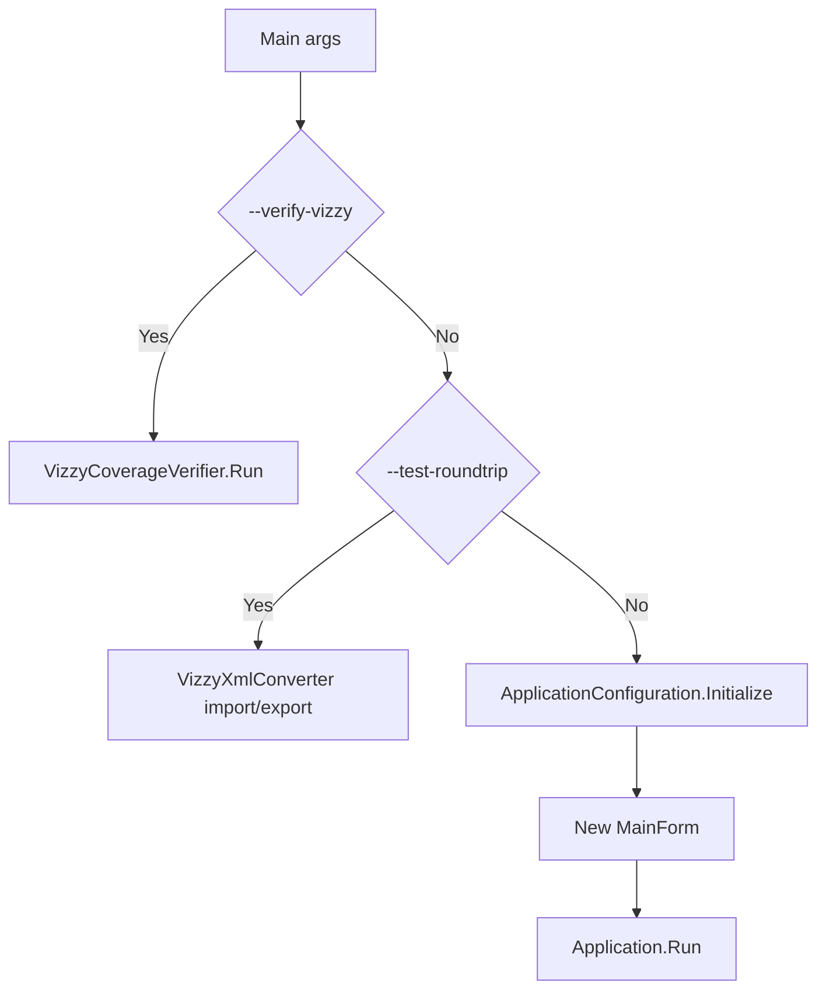

---
tags: [desktop, entrypoint, winforms, script]
type: script
file: Program.cs
related:
  - "[[MainForm.cs]]"
  - "[[VizzyCoverageVerifier.cs]]"
  - "[[VizzyXmlConverter.cs]]"
status: active
---

# Program.cs

`Program.cs` is the WinForms application entry point. It decides whether VizzyCode runs as the interactive desktop app, a repository verification command, or a direct roundtrip test helper. #desktop #entrypoint

> [!info] Main role
> This script is the first routing layer before the UI or conversion engine takes over.

## Responsibilities

| Area | Behavior |
|---|---|
| UI startup | Initializes Windows Forms and opens [[MainForm.cs]]. |
| File argument | Passes the first file argument into the main form. |
| Verification mode | Runs [[VizzyCoverageVerifier.cs]] when called with `--verify-vizzy`. |
| Roundtrip test mode | Loads XML, converts it to code, then converts back to XML. |
| Icon generation | Builds a simple in-memory application icon. |

## Control Flow

## Key Dependencies

| Dependency | Purpose |
|---|---|
| [[MainForm.cs]] | Interactive editor surface. |
| [[VizzyCoverageVerifier.cs]] | Verification command behavior. |
| [[VizzyXmlConverter.cs]] | Roundtrip test conversion. |

## Backlinks

Related notes: [[Component Map]], [[01 - Project Architecture]], [[13 - Recommended Workflows]].

