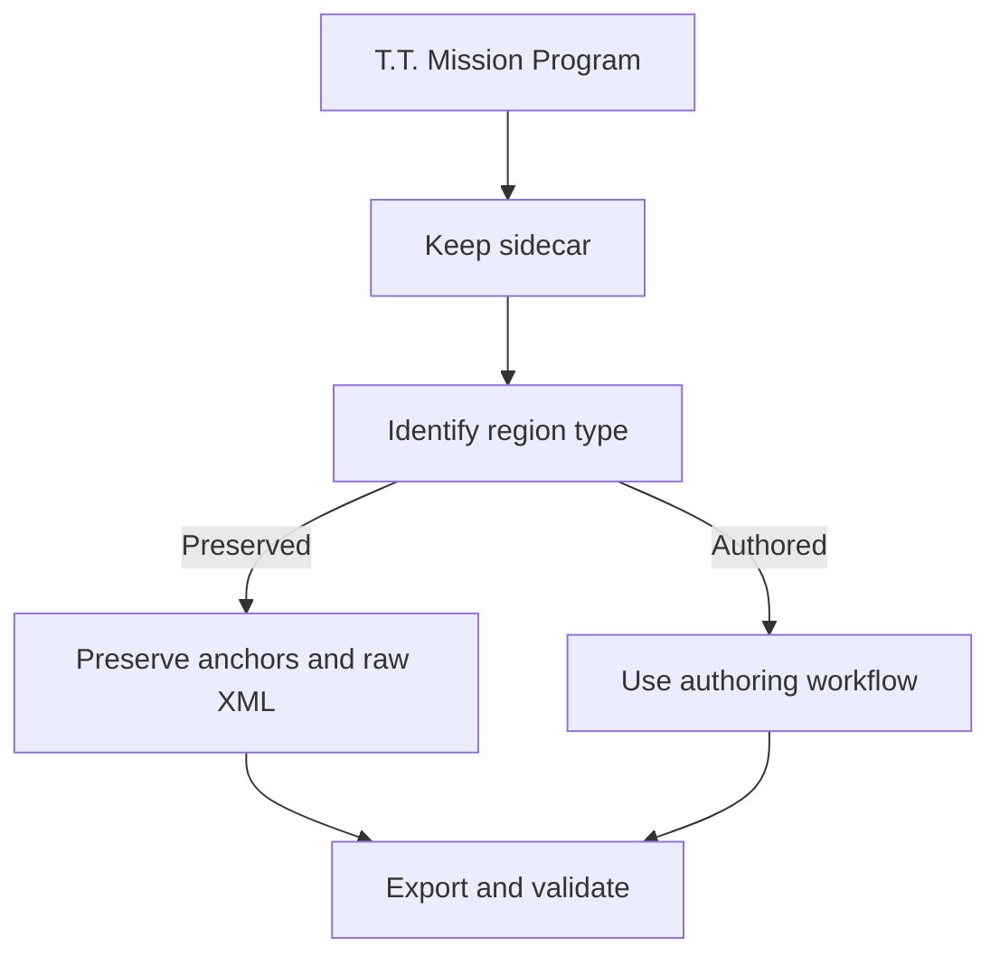

---
tags: [example, imported, mission, fidelity, script]
type: example-script
file: Vizzy examples/Imported C examples/T.T. Mission Program.vizzy.cs
related:
  - "[[12 - Project Examples]]"
  - "[[08 - AI Integration]]"
  - "[[13 - Recommended Workflows]]"
status: active
---

# T.T. Mission Program.vizzy.cs

`T.T. Mission Program.vizzy.cs` is the large mission-scale imported example. It is the most important example for mixed preservation, raw fragments, custom blocks, and deep mission logic. #mission #fidelity

> [!danger] High-sensitivity example
> Treat this file as a fidelity-sensitive mission. Do not use broad cleanup as the first move when debugging it.

## Documentation Use

| Use | Notes |
|---|---|
| Mission-scale testing | Exercises patterns smaller examples do not cover. |
| AI repair context | Demonstrates why [[08 - AI Integration]] requires full context bundles. |
| Mixed-region debugging | Can contain preserved imported regions and authored edits. |
| Export validation | Useful for structural regression checks. |
| Raw preservation | Good case for inspecting `RawXml*` and sidecar behavior. |

## Recommended Handling

## Backlinks

Related notes: [[12 - Project Examples]], [[05 - Raw Preservation]], [[08 - AI Integration]], [[13 - Recommended Workflows]], [[14 - Troubleshooting]].

