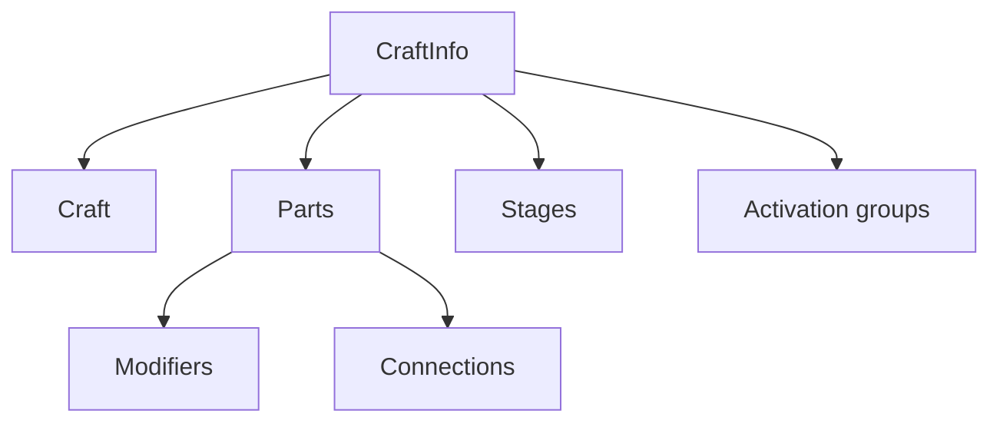

---
tags: [juno, mod, craft, serialization, script]
type: script
file: Mod Assets/Scripts/VizzyCode/CraftInfo.cs
related:
  - "[[VizzyBridge.cs]]"
  - "[[DesignerIntegration.cs]]"
  - "[[08 - AI Integration]]"
status: active
---

# CraftInfo.cs

`CraftInfo.cs` serializes Juno craft information into bridge-friendly data structures. It is the mod-side foundation for craft snapshots, part lists, stage data, and AI context. #craft #serialization

## Responsibilities

| Area | Behavior |
|---|---|
| Craft summary | Captures craft identity and structure. |
| Part metadata | Serializes IDs, names, types, stages, masses, connections, and modifiers. |
| Stage metadata | Captures staging and activation group information. |
| Vizzy capability | Identifies parts that contain or can receive Vizzy programs. |
| AI context | Provides structured data used by reports and context bundles. |

## Data Model

## Backlinks

Related notes: [[Component Map]], [[06 - Juno Live Bridge]], [[09 - Juno Mod (Mod Assets)]], [[08 - AI Integration]].

