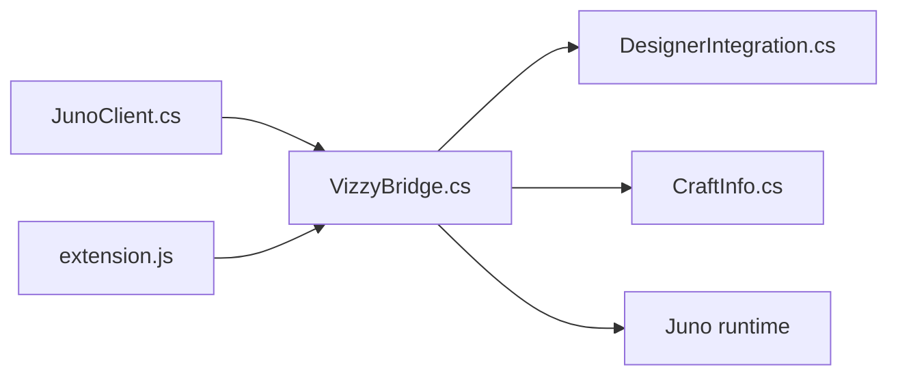

---
tags: [juno, mod, bridge, script]
type: script
file: Mod Assets/Scripts/VizzyCode/VizzyBridge.cs
related:
  - "[[06 - Juno Live Bridge]]"
  - "[[JunoClient.cs]]"
  - "[[CraftInfo.cs]]"
status: active
---

# VizzyBridge.cs

`VizzyBridge.cs` is the Unity-side HTTP bridge server. It exposes local endpoints that VizzyCode and the VS Code extension call for craft data, Vizzy import/export, stages, telemetry, and snapshots. #bridge #juno #mod

## Responsibilities

| Area | Behavior |
|---|---|
| HTTP server | Listens locally for bridge requests. |
| Routing | Maps URL paths to craft, Vizzy, stage, telemetry, and action handlers. |
| Read operations | Provides status, craft, parts, Vizzy XML, stages, snapshots, and telemetry. |
| Write operations | Accepts Vizzy XML for a selected part and stage activation requests. |
| Serialization | Works with [[CraftInfo.cs]] for JSON-friendly payloads. |

## Relationship

## Backlinks

Related notes: [[Component Map]], [[06 - Juno Live Bridge]], [[JunoClient.cs]], [[09 - Juno Mod (Mod Assets)]].

