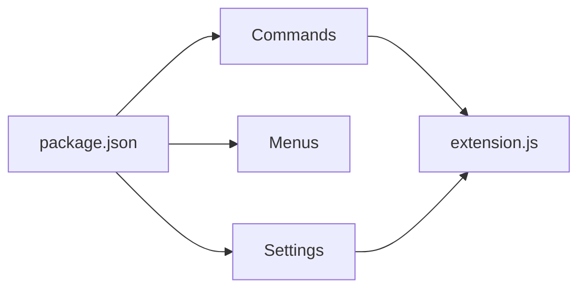

---
tags: [vscode, package-json, extension, script]
type: manifest
file: vscode-extension/package.json
related:
  - "[[extension.js]]"
  - "[[07 - VS Code Extension]]"
  - "[[vscode-extension install.ps1]]"
status: active
---

# VS Code package.json

`vscode-extension/package.json` declares the VS Code extension identity, activation events, contributed commands, menus, configuration, and packaged files. #vscode #manifest

## Responsibilities

| Area | Behavior |
|---|---|
| Extension metadata | Name, display name, description, publisher, category. |
| Activation | Starts on command usage and startup finish. |
| Commands | Exposes import, export, roundtrip, Juno bridge, and report commands. |
| Menus | Adds explorer and editor-title actions for XML and code files. |
| Settings | Defines `vizzycode.cliPath` and `vizzycode.autoOpenResults`. |
| Packaging | Lists extension files and bundled CLI output. |

## Relationship

## Backlinks

Related notes: [[Component Map]], [[extension.js]], [[07 - VS Code Extension]].

