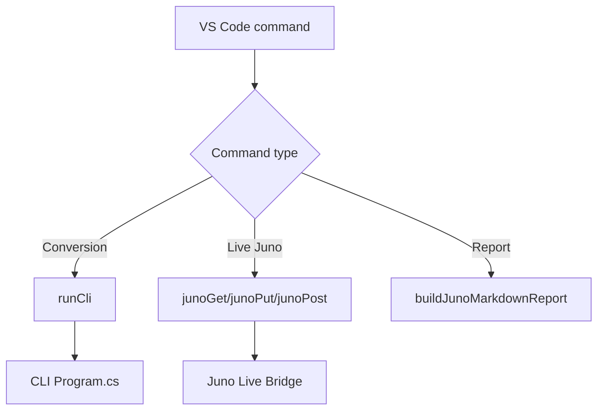

---
tags: [vscode, extension, javascript, script]
type: script
file: vscode-extension/extension.js
related:
  - "[[07 - VS Code Extension]]"
  - "[[CLI Program.cs]]"
  - "[[06 - Juno Live Bridge]]"
status: active
---

# extension.js

`extension.js` implements the VS Code extension commands. It calls the CLI for conversion and calls the Juno bridge for live craft, Vizzy, stage, telemetry, and report operations. #vscode #extension

## Responsibilities

| Area | Behavior |
|---|---|
| Activation | Registers all `vizzycode.*` commands. |
| CLI commands | Import XML, export code, run roundtrip. |
| Juno commands | Connect, browse parts, import/export from game, inspect stages. |
| Data exports | Save telemetry JSON, snapshot JSON, and Markdown reports. |
| CLI discovery | Resolves bundled or configured CLI path. |
| Status bar | Shows extension and Juno connection state. |

## Command Flow

## Backlinks

Related notes: [[Component Map]], [[07 - VS Code Extension]], [[CLI Program.cs]], [[06 - Juno Live Bridge]].

