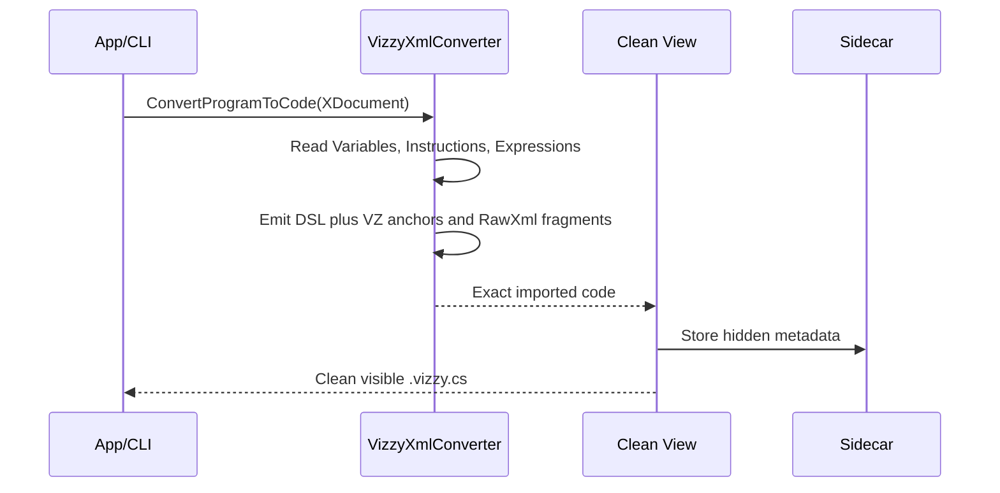
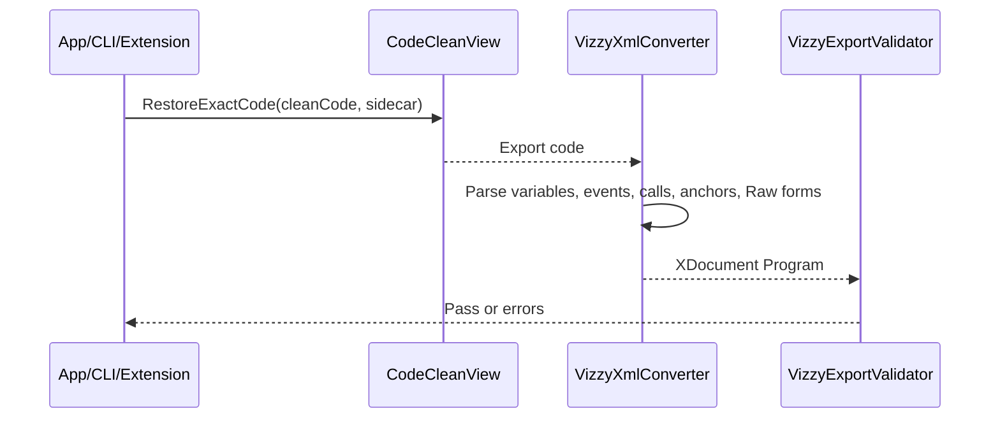

---
tags: [converter, xml, codigo, nucleo]
type: component
related:
  - "[[01 - Project Architecture]]"
  - "[[04 - Export Validation]]"
  - "[[05 - Raw Preservation]]"
status: active
---

# Conversion Engine: VizzyXmlConverter

`VizzyXmlConverter` is the core class that turns Juno Vizzy XML into `.vizzy.cs` and turns `.vizzy.cs` back into Juno-compatible XML. It supports both imported-program fidelity and new-script authoring. #conversion #fidelity #roundtrip

> [!info] Central responsibility
> This class understands Vizzy program structure, variables, events, custom instructions, custom expressions, expressions, raw preservation, layout hints, and preservation anchors.

> [!warning] Different success criteria
> Fidelity work asks whether original XML can survive `XML -> code -> XML`. Authoring work asks whether new code generates XML Juno accepts. Do not judge both with only one metric.

## Public Methods

| Method | Signature | Description |
|---|---|---|
| `Warnings` | `IReadOnlyList<string> Warnings` | Non-fatal conversion diagnostics. |
| `ConvertCraftToCode` | `string ConvertCraftToCode(XDocument doc)` | Converts every `<Program>` found in a craft or assembly XML document. |
| `ConvertProgramToCode` | `string ConvertProgramToCode(XDocument doc)` | Converts a single Vizzy `<Program>` into `.vizzy.cs`. |
| `ConvertExpression` | `string ConvertExpression(XElement el)` | Converts one XML expression node to DSL syntax or raw preservation syntax. |
| `ConvertCodeToXml` | `XDocument ConvertCodeToXml(string code, string programName = "GeneratedProgram")` | Parses `.vizzy.cs` and emits a Vizzy `<Program>` XML document. |

## Import Flow: XML To Code



## Export Flow: Code To XML



> [!danger] Validation remains required
> `ConvertCodeToXml` creates XML. [[04 - Export Validation]] decides whether the XML avoids known Juno-breaking structures.

## Clean View And Sidecar

Imported files use two artifacts:

| Artifact | Purpose |
|---|---|
| `name.vizzy.cs` | Visible editable file, cleaned for humans. |
| `name.vizzy.meta.json` | Hidden fidelity metadata for unchanged imported lines. |

Clean view can hide `VZTOPBLOCK`, `VZBLOCK`, and `VZEL` comments, and can simplify obvious `RawXmlVariable`, `RawXmlConstant`, or simple `RawXmlEval` fragments.

> [!tip] Sidecar rule
> Keep the sidecar with the code file when exact imported fidelity matters.

> [!warning] Edited region rule
> Once a preserved region is rewritten, that region may export as authoring-mode code instead of restored imported XML.

## Preservation Anchors

| Anchor | Syntax | Meaning |
|---|---|---|
| `VZTOPBLOCK` | `// VZTOPBLOCK` | Marks a top-level imported block boundary. |
| `VZBLOCK` | `// VZBLOCK <base64>` | Stores top-level header metadata. |
| `VZEL` | `// VZEL <base64>` | Stores imported element metadata. |

```csharp
// VZTOPBLOCK
// VZBLOCK PEV2ZW50IGV2ZW50PSJGbGlnaHRTdGFydCIgLz4=
using (new OnStart())
{
    // VZEL PFRleHREaXNwbGF5IC8+
    Vz.Display("Launch", 3);
}
```

> [!danger] Anchor deletion changes behavior
> These comments are not noise in exact import output. They carry preservation data used by export.

## Escape Hatches Raw And RawXml

| Method | Payload | XML restored | Use |
|---|---|---|---|
| `Vz.RawConstant("...")` | Base64 | `<Constant>` | Legacy compact constant preservation |
| `Vz.RawXmlConstant(@"<Constant ... />")` | Readable XML | `<Constant>` | Preferred readable constant preservation |
| `Vz.RawVariable("...")` | Base64 | `<Variable>` | Legacy compact variable preservation |
| `Vz.RawXmlVariable(@"<Variable ... />")` | Readable XML | `<Variable>` | Preferred readable variable preservation |
| `Vz.RawCraftProperty("...")` | Base64 | `<CraftProperty>` | Legacy compact craft property preservation |
| `Vz.RawXmlCraftProperty(@"<CraftProperty ... />")` | Readable XML | `<CraftProperty>` | Preferred readable craft property preservation |
| `Vz.RawEval("...")` | Base64 | `<EvaluateExpression>` | Legacy compact eval preservation |
| `Vz.RawXmlEval(@"<EvaluateExpression ... />")` | Readable XML | `<EvaluateExpression>` | Preferred readable eval preservation |
| `Vz.RawVar("name")` | Variable name | `<Variable>` | Exact variable reference escape |
| `Vz.ExactEval("text")` | Text | `<EvaluateExpression>` with text constant | Clean-view shorthand for simple exact evals |

See [[05 - Raw Preservation#Raw Forms Reference]].

## VZPOS Layout Hints

`VZPOS` sets a top-level layout hint that maps to Juno `pos` metadata.

```csharp
// VZPOS x=1200 y=-300
using (new OnStart())
{
    Vz.Display("Ready", 3);
}
```

> [!info] Syntax
> Use `// VZPOS x=N y=N` before a top-level event, custom instruction, custom expression, or comment block.

## Internal State Worth Knowing

| Field | Purpose |
|---|---|
| `_listVariables` | Tracks list variables for correct list export. |
| `_warnings` | Collects conversion warnings. |
| `_localVariables` | Tracks custom-instruction parameters. |
| `_ciNameMap` | Maps sanitized identifiers to custom instruction/expression names. |
| `_pendingTopLevelHeader` | Holds restored `VZBLOCK` metadata. |
| `_pendingInstructionMetadata` | Holds restored `VZEL` metadata. |
| `_pendingTopLevelPosition` | Holds `VZPOS` coordinates before block emission. |

<details>
<summary>Converter debugging checklist</summary>

- [ ] Decide whether the issue is import, export, or clean-view restoration.
- [ ] Check whether the source file has a sidecar.
- [ ] Check whether the failing region is preserved or handwritten.
- [ ] Decode `Raw*` payloads with [[03 - CLI (VizzyCode.Cli)#Raw Decode]].
- [ ] Validate output through [[04 - Export Validation]].

</details>

## Backlinks

Related notes: [[01 - Project Architecture]], [[03 - CLI (VizzyCode.Cli)]], [[04 - Export Validation]], [[05 - Raw Preservation]], [[10 - Vizzy Authoring Guide]], [[11 - Vizzy Blocks Reference]].


