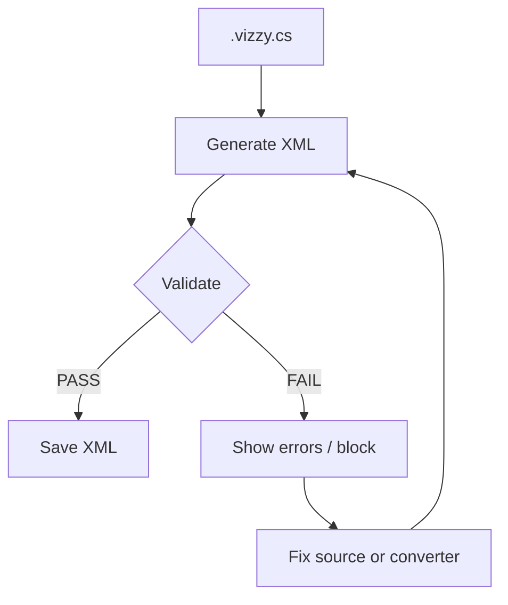

---
tags: [validation, xml, juno, errors]
type: validation
related:
  - "[[02 - Conversion Engine (VizzyXmlConverter)]]"
  - "[[03 - CLI (VizzyCode.Cli)]]"
  - "[[14 - Troubleshooting]]"
status: active
---

# Export Validation

Export validation runs after `.vizzy.cs` has been converted to XML and before the result is saved. It blocks known structural patterns that Juno rejects. #validation #xml #juno

> [!info] Source
> The validator lives in `VizzyExportValidator.cs` and is used by the desktop app, CLI, and VS Code extension through the CLI.

## Validation Flow



## Validation Rules

> [!danger] Rule 1: Root
> The root element must be `<Program>`.

> [!danger] Rule 2: Instructions
> The program must contain at least one top-level `<Instructions>` block.

> [!danger] Rule 3: EvaluateExpression style
> Every `<EvaluateExpression>` must include `style="evaluate-expression"`.

```xml
<EvaluateExpression style="evaluate-expression">
  <Constant text="E" />
</EvaluateExpression>
```

> [!danger] Rule 4: No raw Else
> Raw `<Else>` nodes are not allowed. Use the Juno-safe `ElseIf style="else"` representation.

> [!danger] Rule 5: Else condition
> `<ElseIf style="else">` must include a leading `<Constant bool="true" />` condition.

```xml
<ElseIf style="else">
  <Constant bool="true" />
  <Instructions />
</ElseIf>
```

> [!danger] Rule 6: Top-level pos
> Top-level `Event`, `CustomInstruction`, `CustomExpression`, and `Comment` roots must have a `pos` attribute.

```csharp
// VZPOS x=1200 y=-300
using (new OnStart())
{
    Vz.Display("Ready", 3);
}
```

> [!danger] Rule 7: CustomInstruction metadata
> Top-level `CustomInstruction` nodes must include `callFormat`, `format`, and `name`.

> [!danger] Rule 8: CustomExpression metadata
> Top-level `CustomExpression` nodes must include `callFormat`, `format`, and `name`.

> [!danger] Rule 9: Event metadata
> Top-level `Event` nodes must include `event`.

> [!note] Rule count note
> Some summaries group the custom instruction, custom expression, and event metadata checks differently. The implementation enforces each required attribute explicitly.

## Patterns That Break Juno

| Pattern | Problem | Correction |
|---|---|---|
| Root is not `<Program>` | The document is not a Vizzy program. | Export a single `<Program>` node. |
| Missing `<Instructions>` | No executable top-level graph. | Add an event, custom instruction, or preamble block. |
| Missing `EvaluateExpression` style | Known invalid structure. | Emit `style="evaluate-expression"`. |
| Raw `<Else>` | Wrong control-flow shape. | Use `ElseIf style="else"` plus true constant. |
| Missing top-level `pos` | Top-level editor metadata is incomplete. | Add `// VZPOS x=N y=N` or preserve imported `pos`. |
| Missing custom block metadata | Juno cannot identify the custom declaration. | Include `callFormat`, `format`, and `name`. |
| Missing event attribute | Handler has no event identity. | Use supported event syntax from [[10 - Vizzy Authoring Guide#Event Handler Syntax]]. |
| Missing sidecar for imported file | Exact hidden metadata cannot be restored. | Keep the `.vizzy.meta.json` next to the code file. |

## Where Validation Runs

| Surface | Behavior |
|---|---|
| Desktop app | Validates before saving XML and blocks invalid output. |
| CLI `export` | Validates before writing the XML file. |
| CLI `roundtrip` | Validates regenerated XML. |
| VS Code extension | Validates through the CLI. |

## Coverage Verification

```powershell
dotnet run --project VizzyCode.csproj -c Release -- --verify-vizzy
```

The verifier scans repository examples and reports export validity, round-trip status, TODO markers, and first validation errors.

<details>
<summary>Validation checklist</summary>

- [ ] Export using the desktop app or CLI.
- [ ] Read all validator messages before changing the converter.
- [ ] Check `VZPOS` for authored top-level blocks.
- [ ] Check sidecar presence for imported files.
- [ ] Decode raw fragments before rewriting them.
- [ ] Open the result in Juno for important scripts.

</details>

## Backlinks

Related notes: [[02 - Conversion Engine (VizzyXmlConverter)]], [[03 - CLI (VizzyCode.Cli)]], [[05 - Raw Preservation]], [[10 - Vizzy Authoring Guide]], [[13 - Recommended Workflows]], [[14 - Troubleshooting]].


