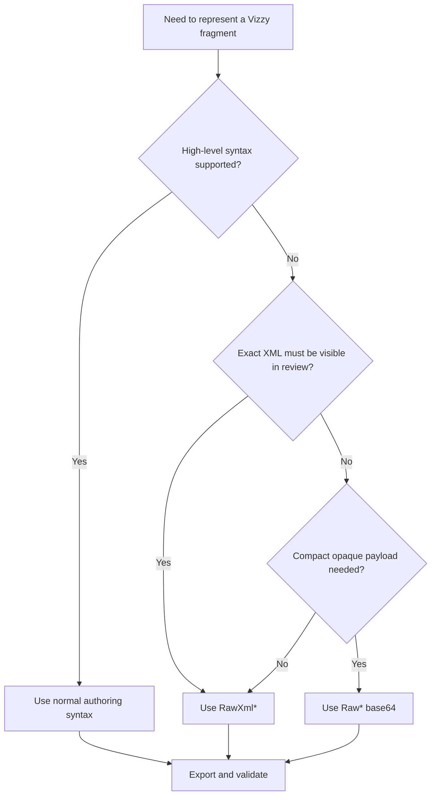

---
tags: [raw, preservation, fidelity, base64]
type: reference
related:
  - "[[02 - Conversion Engine (VizzyXmlConverter)]]"
  - "[[03 - CLI (VizzyCode.Cli)]]"
  - "[[04 - Export Validation]]"
status: active
---

# Raw Preservation

Raw preservation keeps exact Vizzy XML fragments when high-level `.vizzy.cs` syntax is not enough or when imported fidelity matters. #raw #fidelity #base64

> [!info] Two families
> `Raw*` stores XML as base64. `RawXml*` stores equivalent XML in readable form. Prefer readable XML unless compact opaque payloads are required.

> [!danger] Raw does not bypass validation
> A raw-preserved fragment still contributes to exported XML and is still checked by [[04 - Export Validation]].

## Raw Forms Reference

| Base64 form | Readable form | XML node | Recommended use |
|---|---|---|---|
| `Vz.RawConstant("...")` | `Vz.RawXmlConstant(@"<Constant ... />")` | `<Constant>` | Preserve constant attributes exactly. |
| `Vz.RawVariable("...")` | `Vz.RawXmlVariable(@"<Variable ... />")` | `<Variable>` | Preserve local/list/name metadata exactly. |
| `Vz.RawCraftProperty("...")` | `Vz.RawXmlCraftProperty(@"<CraftProperty ... />")` | `<CraftProperty>` | Preserve craft-property XML not covered by clean syntax. |
| `Vz.RawEval("...")` | `Vz.RawXmlEval(@"<EvaluateExpression ... />")` | `<EvaluateExpression>` | Preserve exact expression graph. |
| `Vz.RawVar("name")` | N/A | `<Variable>` reference | Force an exact variable-name reference. |
| N/A | `Vz.ExactEval("text")` | Simple `<EvaluateExpression>` | Clean-view shorthand for exact text constants. |

## Decision Tree



> [!tip] Preference hierarchy
> 1. Normal authoring syntax.
> 2. Readable `RawXml*`.
> 3. Base64 `Raw*` only for compact or legacy payloads.

## Raw Encode And Decode

Generate canonical raw forms from an XML element:

```powershell
dotnet run --project VizzyCode.Cli\VizzyCode.Cli.csproj -- raw-encode "snippet.xml" -o "raw-snippet.txt"
```

Decode a raw form back to XML:

```powershell
dotnet run --project VizzyCode.Cli\VizzyCode.Cli.csproj -- raw-decode "raw-snippet.txt" -o "decoded.xml"
```

Decode a call directly:

```powershell
dotnet run --project VizzyCode.Cli\VizzyCode.Cli.csproj -- raw-decode "Vz.RawEval(\"...\")" -o "decoded.xml"
```

## Example

```csharp
Vz.RawXmlEval(@"<EvaluateExpression style=""evaluate-expression""><Constant text=""E"" /></EvaluateExpression>")
```

Equivalent compact form:

```csharp
Vz.RawEval("PEV2YWx1YXRlRXhwcmVzc2lvbiBzdHlsZT0iZXZhbHVhdGUtZXhwcmVzc2lvbiI+PENvbnN0YW50IHRleHQ9IkUiIC8+PC9FdmFsdWF0ZUV4cHJlc3Npb24+")
```

## When To Use Raw Preservation

| Situation | Use raw? | Notes |
|---|---|---|
| New simple script | Usually no | Prefer normal authoring syntax from [[10 - Vizzy Authoring Guide]]. |
| Imported mission with exact XML needs | Yes | Preserve exact fragments and keep the sidecar. |
| Unsupported expression shape | Maybe | Use `RawXml*` until converter support exists. |
| AI repair on mixed mission | Often yes | Treat raw fragments as explicit boundaries unless proven otherwise. |
| Cosmetic cleanup | No | Do not replace exact XML only because cleaner code is possible. |

<details>
<summary>Raw preservation checklist</summary>

- [ ] Determine whether the fragment came from imported XML.
- [ ] Prefer `RawXml*` for reviewable exact XML.
- [ ] Decode base64 before editing it.
- [ ] Keep sidecar metadata when the file was imported.
- [ ] Re-export and validate after each raw fragment change.

</details>

## Backlinks

Related notes: [[02 - Conversion Engine (VizzyXmlConverter)]], [[03 - CLI (VizzyCode.Cli)]], [[04 - Export Validation]], [[08 - AI Integration]], [[13 - Recommended Workflows]], [[14 - Troubleshooting]].


