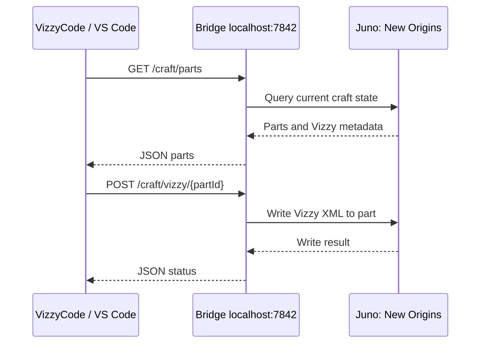
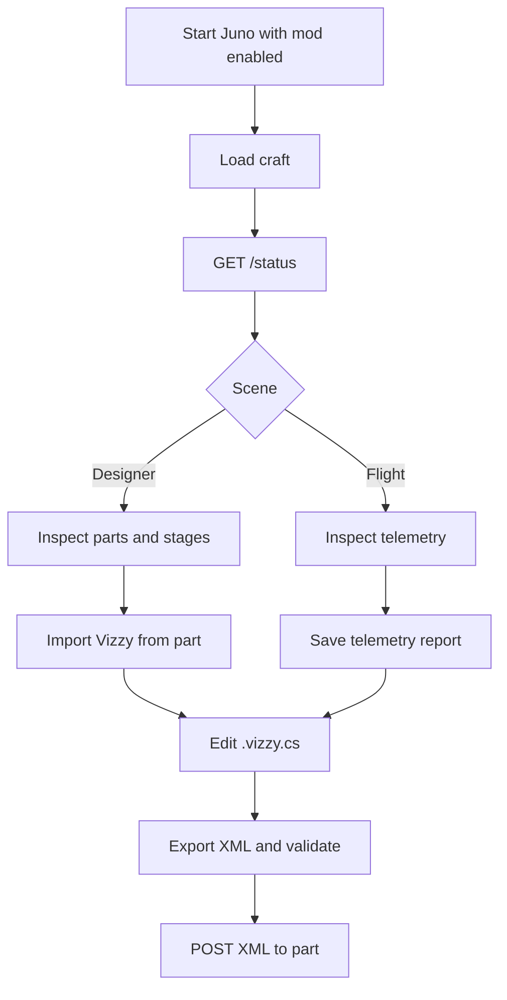

---
tags: [bridge, juno, http, live, mod]
type: integration
related:
  - "[[09 - Juno Mod (Mod Assets)]]"
  - "[[07 - VS Code Extension]]"
  - "[[08 - AI Integration]]"
status: active
---

# Juno Live Bridge

The Juno Live Bridge is a localhost HTTP bridge exposed by the optional Juno mod. VizzyCode and the VS Code extension use it to inspect the loaded craft, import/export Vizzy programs from parts, capture telemetry, and save craft snapshots. #bridge #juno #live

> [!info] Base URL
> The bridge listens locally at `http://127.0.0.1:7842/`.

> [!warning] Local editing tool
> Treat the bridge as a local live-editing and diagnostics tool. Keep normal craft saves and XML files as your durable working copies.

## Client-Server Architecture

## Endpoint Reference

| Method | Route | Description | Response |
|---|---|---|---|
| `GET` | `/status` | Bridge/mod status and active scene. | JSON status object. |
| `GET` | `/craft/parts` | Loaded craft parts and Vizzy-capable parts. | JSON part list. |
| `GET` | `/craft/vizzy/{partId}` | Imports Vizzy XML from one part. | XML or JSON-wrapped XML depending client path. |
| `POST` | `/craft/vizzy/{partId}` | Exports Vizzy XML into one part. | JSON write result. |
| `GET` | `/craft/stages` | Stage metadata and activation groups. | JSON stage model. |
| `GET` | `/craft/snapshot` | Full craft snapshot for humans/AI and diagnostics. | JSON snapshot. |
| `GET` | `/telemetry` | Active flight telemetry. | JSON telemetry with quality fields. |
| `POST` | `/stage/activate` | Activates the next stage. | JSON action result. |

> [!note] Documentation naming
> Some internal bridge documentation also describes shorter or expanded endpoint aliases. This wiki keeps the routes used by the current app and VS Code workflow.

## Scene Awareness

| Scene | Reliable data | Caution |
|---|---|---|
| Menu | Bridge status only. | No craft context. |
| Designer | Craft structure, parts, stages, Vizzy programs. | Flight telemetry values are not runtime flight data. |
| Flight | Craft structure plus live telemetry. | Quality flags still matter for active vs fallback data. |

> [!tip] Check quality first
> Telemetry and snapshots should be interpreted through quality flags such as designer/static data vs active flight data.

## Telemetry And Craft Snapshots

| Payload | Use |
|---|---|
| Craft snapshot JSON | Part names, IDs, stages, activation groups, craft structure, Vizzy-capable parts. |
| Telemetry JSON | Altitude, velocity, mass, fuel, thrust, orbit, attitude, nav target, and flight state when available. |
| Craft report Markdown | Readable AI/human context generated by `JunoReportBuilder`. |
| Telemetry report Markdown | Readable runtime diagnostic summary. |

See [[08 - AI Integration#Context Bundles]] for how to include bridge reports in AI repair work.

## Bridge Workflow

## Related Mod Components

| Component | Responsibility |
|---|---|
| `VizzyBridge.cs` | HTTP server, request routing, response formatting. |
| `VizzyCodeMod.cs` | Mod lifecycle entry point. |
| `VizzyCodeUpdater.cs` | Update loop and runtime state refresh. |
| `DesignerIntegration.cs` | Designer scene craft and part integration. |
| `CraftInfo.cs` | Craft, part, stage, modifier, and telemetry serialization support. |

## Backlinks

Related notes: [[01 - Project Architecture]], [[07 - VS Code Extension]], [[08 - AI Integration]], [[09 - Juno Mod (Mod Assets)]], [[13 - Recommended Workflows]], [[14 - Troubleshooting]].

