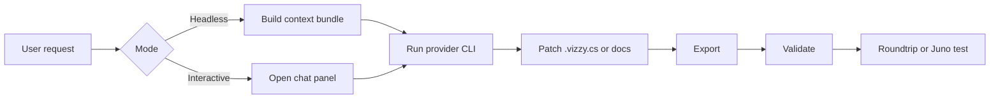

---
tags: [ia, claude, gemini, openai, opencode, prompts]
type: integration
related:
  - "[[05 - Raw Preservation]]"
  - "[[06 - Juno Live Bridge]]"
  - "[[14 - Troubleshooting]]"
status: active
---

# AI Integration

VizzyCode integrates with multiple headless AI tools and provides guidance for giving AI agents enough context to repair Vizzy missions without damaging fidelity-sensitive regions. #ia #prompts

> [!danger] Do not provide only the `.cs` file
> A `.vizzy.cs` file alone is insufficient context for mission repair. Include the project docs, validator state, original XML when available, sidecar metadata, and bridge reports when craft-specific behavior matters.

## Providers

| Provider | CLI command | Default model | Interactive mode |
|---|---|---|---|
| Claude | `claude -p --verbose --output-format stream-json --include-partial-messages` | Configured by Claude CLI | Headless stream JSON plus optional UI integration |
| Gemini | `gemini` headless binary | `gemini-2.5-pro` | Headless command execution |
| OpenAI/Codex | `codex exec --json` | `gpt-5-codex` | JSON execution mode |
| OpenCode | `opencode run --format json` | Provider configuration | Supports custom Base URL |

Settings file:

```powershell
%AppData%\VizzyCode\ai-settings.json
```

## AI Flow



## Context Bundles

### Minimum bundle for normal authoring

1. `README.md`
2. `docs/VizzyAuthoringGuide.md`
3. `docs/VizzyBlocksMegaGuide.md`
4. `docs/ExportValidationAndCoverageGuide.md`
5. Current `.vizzy.cs` file

### Minimum bundle for AI repair

1. `README.md`
2. `docs/VizzyAuthoringGuide.md`
3. `docs/VizzyBlocksMegaGuide.md`
4. `docs/AiRepairContextGuide.md`
5. `docs/RawPreservationGuide.md`
6. `docs/ExportValidationAndCoverageGuide.md`
7. Current `.vizzy.cs`
8. Current validator output

### Complete fidelity-sensitive bundle

1. Original working XML
2. Current `.vizzy.cs`
3. Current exported XML if it exists
4. Matching `.vizzy.meta.json` sidecar
5. Raw fragment decode output for any unclear `Raw*` payloads
6. CLI export output
7. VS Code export output if tool parity is being checked
8. Craft snapshot report if part names, stages, mass, fuel, or activation groups matter
9. Telemetry report if runtime state matters

> [!tip] Reports first
> Prefer bridge-generated Markdown reports for AI context, then include JSON only when exact raw fields are needed.

## Repair Rules For AI

| Rule | Reason |
|---|---|
| Determine source of truth first. | Original XML and current code can diverge. |
| Check whether the region has `VZTOPBLOCK`, `VZBLOCK`, or `VZEL`. | Anchors indicate preserved imported structure. |
| Do not rewrite raw fragments blindly. | `RawXml*` often marks an exact XML boundary. |
| Fix one structural issue at a time. | Juno load failures can stack. |
| Run export validation after every change. | Validator catches known invalid shapes. |

## Prompt Template

```text
Investigate this Vizzy mission without globally rewriting it.

First determine whether the original XML or the current .vizzy.cs is the source of truth.
Then identify whether the failing region is preserved imported XML or handwritten authoring code.
If the region has VZTOPBLOCK, VZBLOCK, VZEL, RawXml*, or a sidecar entry, treat that as a fidelity boundary unless proven otherwise.
Run export validation and fix one exact XML structural issue at a time.
Do not replace raw-preserved fragments only for readability.
```

## Backlinks

Related notes: [[02 - Conversion Engine (VizzyXmlConverter)]], [[04 - Export Validation]], [[05 - Raw Preservation]], [[06 - Juno Live Bridge]], [[10 - Vizzy Authoring Guide]], [[14 - Troubleshooting]].


