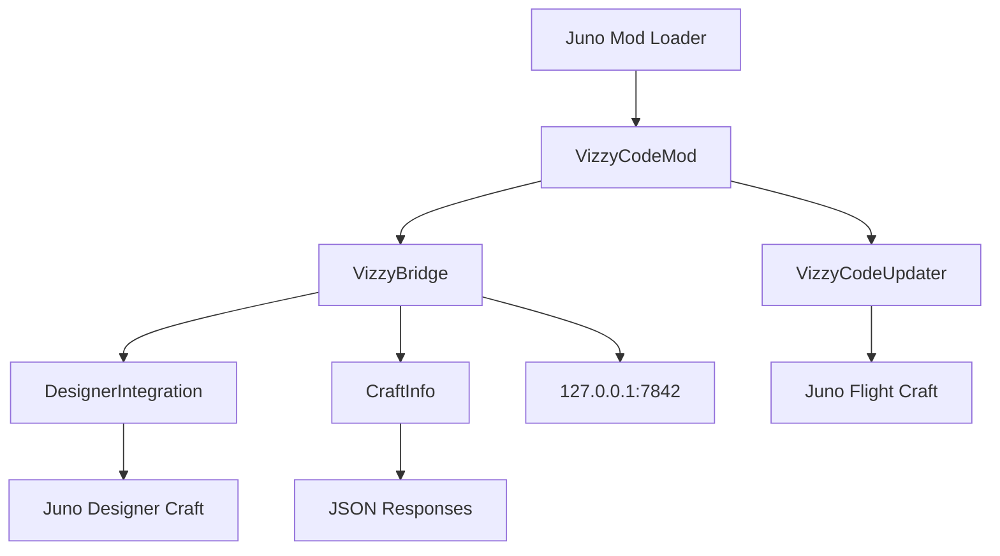

---
tags: [mod, unity, juno, bridge, servidor]
type: component
related:
  - "[[06 - Juno Live Bridge]]"
  - "[[01 - Project Architecture]]"
  - "[[08 - AI Integration]]"
status: active
---

# Juno Mod: Mod Assets

The Juno mod is the game-side component that exposes craft, Vizzy, stage, and telemetry data to VizzyCode over localhost. It runs inside Juno through Unity mod infrastructure. #mod #unity #bridge

> [!info] Scope
> The mod is not part of the WinForms desktop compilation. It lives under `Mod Assets/Scripts/VizzyCode` and is excluded from `VizzyCode.csproj`.

## Mod Scripts

| File | Class | Responsibility |
|---|---|---|
| `VizzyBridge.cs` | `VizzyBridge` | HTTP bridge server, endpoint routing, request/response handling. |
| `VizzyCodeMod.cs` | `VizzyCodeMod` | Mod entry point and lifecycle integration. |
| `VizzyCodeUpdater.cs` | `VizzyCodeUpdater` | Runtime update loop and state refresh. |
| `DesignerIntegration.cs` | `DesignerIntegration` | Designer-scene access to craft parts and Vizzy program data. |
| `CraftInfo.cs` | `CraftInfo` | Serialization of craft, part, stage, activation group, modifier, and related data. |

## Unity-Side Architecture

## HTTP Server Role

`VizzyBridge` exposes read and write operations that the desktop app and VS Code extension can call:

| Operation | Bridge role |
|---|---|
| Status | Report active scene and mod availability. |
| Part listing | Identify craft parts and Vizzy-capable parts. |
| Vizzy import | Read XML from a part. |
| Vizzy export | Write XML to a part. |
| Stages | Serialize stage and activation group metadata. |
| Snapshot | Serialize a full craft context payload. |
| Telemetry | Serialize active flight data when available. |

## CraftInfo Serialization

`CraftInfo.cs` is responsible for turning Juno craft structures into stable JSON-friendly data:

| Data group | Examples |
|---|---|
| Craft identity | Craft name, part count, active command pod, root part. |
| Parts | IDs, names, types, tags, mass, dry/wet mass, positions, rotations. |
| Connections | Parent/child relationships and body structure. |
| Modifiers | Modifier names, type IDs, mass, scale, activation groups. |
| Stages | Current stage, stage groups, activation groups, part membership. |
| Vizzy status | Which parts have a Vizzy program. |

> [!tip] AI context
> Craft snapshots are useful for AI because they ground generated Vizzy code in real part names, stage layout, and available craft data. See [[08 - AI Integration#Context Bundles]].

Mod debugging checklist

- [ ] Confirm Juno is running with the mod enabled.
- [ ] Call `GET /status`.
- [ ] Confirm the active scene.
- [ ] Call craft/part endpoints before importing or exporting Vizzy.
- [ ] Save a craft snapshot before AI-assisted authoring.
- [ ] Save telemetry only when runtime flight state matters.

## Backlinks

Related notes: [[01 - Project Architecture]], [[06 - Juno Live Bridge]], [[07 - VS Code Extension]], [[08 - AI Integration]], [[14 - Troubleshooting]].

