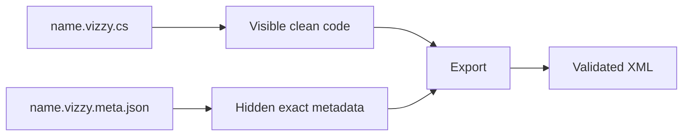

---
tags: [examples, vizzy, imported, mission]
type: reference
related:
  - "[[10 - Vizzy Authoring Guide]]"
  - "[[13 - Recommended Workflows]]"
  - "[[14 - Troubleshooting]]"
status: active
---

# Project Examples

The imported examples are practical regression and learning material. Each `.vizzy.cs` imported example should be considered together with its `.vizzy.meta.json` sidecar. #examples #vizzy

> [!info] Location
> Main imported examples live under `Vizzy examples/Imported C examples`.

## Example Table

| File | Type | Description | Fidelity notes |
|---|---|---|---|
| `Altair Alphard Vizzy.vizzy.cs` | Imported clean-view code | Craft or mission program from an Altair example. | Keep sidecar for exact export. |
| `Altair Alphard Vizzy.vizzy.meta.json` | Sidecar | Hidden import metadata. | Required for clean-view fidelity restoration. |
| `Altair Basic Function.vizzy.cs` | Imported clean-view code | Smaller function-oriented example. | Useful for custom block checks. |
| `Altair Basic Function.vizzy.meta.json` | Sidecar | Hidden metadata for the code file. | Keep paired with code. |
| `MFD Default.vizzy.cs` | Imported clean-view code | MFD-related default program. | Useful for widget and UI block coverage. |
| `MFD Default.vizzy.meta.json` | Sidecar | Hidden metadata. | Keep paired with code. |
| `T.T. Mission Program.vizzy.cs` | Imported mission | Large mission-scale example. | Fidelity-sensitive and useful for mixed-region diagnostics. |
| `T.T. Mission Program.vizzy.meta.json` | Sidecar | Hidden metadata for T.T. | Keep paired with code. |
| `Universal Vizzy Mission 2.vizzy.cs` | Imported mission | Universal mission automation example. | Useful for broader flow coverage. |
| `Universal Vizzy Mission 2.vizzy.meta.json` | Sidecar | Hidden metadata. | Keep paired with code. |

## T.T. Mission Program

> [!warning] Complex example
> `T.T. Mission Program` should be treated as a high-signal example for mission-scale behavior: preserved regions, custom blocks, orbital math, raw fragments, and manually edited areas can coexist.

Use it when testing:

| Area | Why |
|---|---|
| Round-trip fidelity | Large enough to expose preservation gaps. |
| Custom blocks | Exercises top-level metadata and call formats. |
| Orbital math | Contains nested expressions that can be fidelity-sensitive. |
| AI repair | Demonstrates why context bundles matter. |
| Export validation | Good candidate for catching structural regressions. |

## Pair Rule

> [!danger] Pair files intentionally
> For imported examples, treat `.vizzy.cs` and `.vizzy.meta.json` as a pair. If the sidecar is absent, unchanged imported lines may no longer have their exact hidden metadata.

## How To Use Examples

| Task | Example strategy |
|---|---|
| Learn authoring syntax | Compare imported code against [[10 - Vizzy Authoring Guide]]. |
| Debug validation | Export an example and inspect [[04 - Export Validation]] output. |
| Check raw preservation | Search for `RawXml*` and compare with [[05 - Raw Preservation]]. |
| Check MFD behavior | Use `MFD Default`. |
| Check mission-scale behavior | Use `T.T. Mission Program`. |

Example testing checklist

- [ ] Copy both `.vizzy.cs` and `.vizzy.meta.json` when moving an imported example.
- [ ] Export through the CLI.
- [ ] Check validation output.
- [ ] Use roundtrip for original XML sources.
- [ ] Open generated XML in Juno for important behavior.

## Backlinks

Related notes: [[03 - CLI (VizzyCode.Cli)]], [[04 - Export Validation]], [[05 - Raw Preservation]], [[10 - Vizzy Authoring Guide]], [[11 - Vizzy Blocks Reference]], [[13 - Recommended Workflows]].

