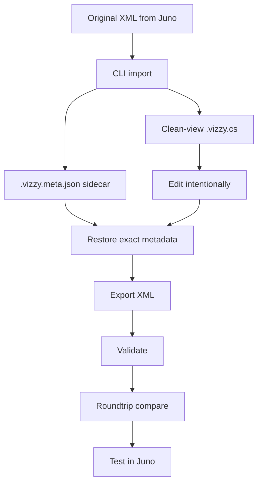
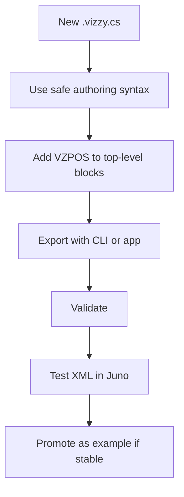
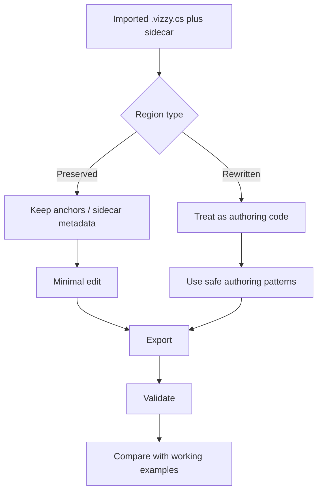

# Recommended Workflows

Use these workflows to keep source-of-truth, sidecar, raw preservation, validation, and Juno testing clear. #workflow #roundtrip

> [!info] First decision
> Decide whether the source of truth is the original Juno XML or the current `.vizzy.cs`.

## Workflow A Existing Juno XML

- [ ] Import XML with `VizzyCode.Cli import`.
- [ ] Keep `.vizzy.meta.json` beside `.vizzy.cs`.
- [ ] Identify preserved anchors or hidden sidecar boundaries.
- [ ] Edit only the intended region.
- [ ] Export with validation.
- [ ] Run `roundtrip` if fidelity is required.
- [ ] Test generated XML in Juno.

> [!tip] Preserve before rewriting
> If a region still maps to imported XML, prefer preserving it unless there is a clear reason to author it anew.

## Workflow B New Script From Scratch

- [ ] Start from [[10 - Vizzy Authoring Guide]].
- [ ] Use normal authoring syntax before raw preservation.
- [ ] Add `// VZPOS x=N y=N` before top-level authored blocks.
- [ ] Export with [[03 - CLI (VizzyCode.Cli)#Export]].
- [ ] Fix every validation error.
- [ ] Test in Juno.
- [ ] Save working XML as a reference if it becomes reusable.

## Workflow C Deep Edit Of Imported XML

- [ ] Mark which regions are preserved imported XML.
- [ ] Mark which regions are intentionally rewritten authoring code.
- [ ] Do not remove `RawXml*` unless the replacement is proven safe.
- [ ] Decode `Raw*` payloads before editing.
- [ ] Validate after each focused change.
- [ ] Compare generated XML with working examples for the same pattern.

> [!warning] Mixed-region files
> Large missions can contain both preserved and rewritten regions. Debug the exact region, not the whole file at once.

Universal pre-export checklist

- [ ] Source of truth is known.
- [ ] Sidecar presence is known.
- [ ] `VZPOS` exists for authored top-level blocks.
- [ ] Raw fragments have been inspected if edited.
- [ ] Export validation passes.
- [ ] Juno test is planned for important scripts.

## Backlinks

Related notes: [[00 - Home]], [[03 - CLI (VizzyCode.Cli)]], [[04 - Export Validation]], [[05 - Raw Preservation]], [[08 - AI Integration]], [[14 - Troubleshooting]].

