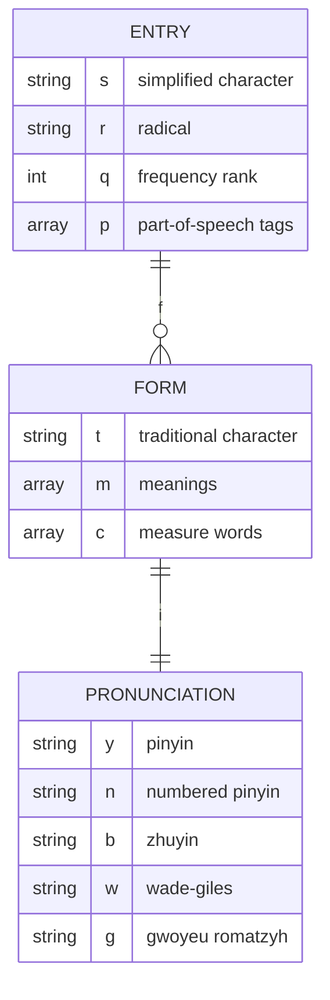
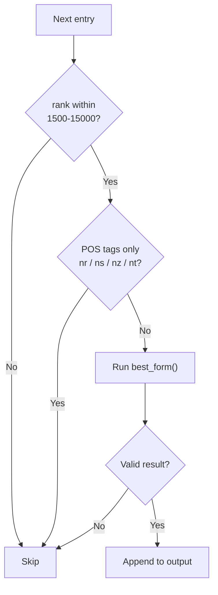
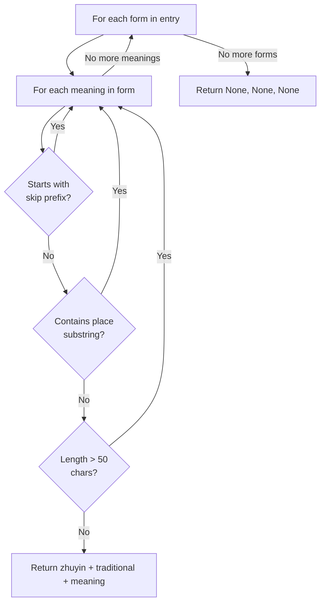

# Learning Mandarin While Vibe Coding

I have been studying Mandarin for a while now. I recently came across [this article on Zenn](https://zenn.dev/acompany/articles/3ba7eb3308dad6) where the author uses Claude Code's `spinnerVerbs` feature to display English conversation phrases while waiting for Claude to process. The idea is simple: instead of staring at a spinner doing nothing, you get a flashcard. I thought it would be interesting to do something similar for Mandarin.

I found a dataset on GitHub called [complete-hsk-vocabulary](https://github.com/drkameleon/complete-hsk-vocabulary) by drkameleon. It compiles the full HSK 2.0 and 3.0 vocabulary lists into a single JSON file with pinyin, part-of-speech tags, frequency rankings, and CC-CEDICT definitions for each entry. The minified version has over 10,000 entries, but before using it I needed to clean it up. Surnames, place names, cross-references, obscure words, and verbose definitions were all mixed in with the useful vocabulary.

This article documents how I wrote a Python script to filter it down into a clean word list.

## Understanding the JSON Structure

The dataset is a JSON array where each entry looks like this:

```json
{
  "s": "爱",
  "r": "爫",
  "q": 130,
  "p": ["v", "vn", "b"],
  "f": [
    {
      "t": "愛",
      "i": {
        "y": "ài",
        "n": "ai4",
        "w": "ai⁴",
        "b": "ㄞˋ",
        "g": "ay"
      },
      "m": ["to love; to be fond of; to like", "affection"],
      "c": ["份"]
    }
  ]
}
```

The top-level fields are:

- `s` — simplified Chinese character
- `r` — radical (部首)
- `q` — frequency rank (lower = more common)
- `p` — part-of-speech tags
- `f` — array of forms, each with its own pronunciation and meanings

Inside each form, the `i` object holds pronunciation in multiple romanization systems. The field I use is `b`, which is Zhuyin (注音, also known as Bopomofo). The `t` field holds the traditional Chinese form of the character, and `m` holds the English definitions.

A single character can have multiple forms because it may have different readings with distinct meanings. The structure reflects this one-to-many relationship:



## The Target Format

The goal is to produce a JSON file in this shape:

```json
{
  "spinnerVerbs": {
    "mode": "replace",
    "verbs": [
      "背景 (ㄅㄟˋ ㄐㄧㄥˇ) - background; backdrop; context",
      "拜访 / 拜訪 (ㄅㄞˋ ㄈㄤˇ) - to pay a visit; to call on",
      "丰富 / 豐富 (ㄈㄥ ㄈㄨˋ) - rich"
    ]
  }
}
```

Each string follows the format `{simplified} ({zhuyin}) - {first meaning}`, with the traditional form included as `{simplified} / {traditional}` only when the two differ.

## Filtering Strategy

### Frequency Range

The `q` field is a corpus frequency rank. I wanted a range that skipped the very basics but stopped before the really obscure vocabulary.

Looking at where some words fall:

- Rank ~1: 的
- Rank ~130: 爱
- Rank ~3000: 地铁, 女朋友, 尴尬
- Rank ~41000: 钻空子

I settled on a window of **1500 to 15000**. The lower bound removes the ultra-high-frequency words that any beginner already knows. The upper bound removes words that would rarely come up in real conversation.

### Part-of-Speech Exclusions

Some entries are tagged exclusively as proper nouns or place names. The relevant POS codes are `nr` for personal names, `ns` for place names, `nz` for other proper nouns, and `nt` for organization names. If an entry's entire `p` array consists only of these tags, the entry is skipped.

### Meaning-Level Exclusions

Some forms within an otherwise valid entry are still useless. The character 安, for example, has a surname form and a regular adjective form. Rather than skipping the whole entry, the script skips any meaning that starts with a known bad prefix:

```python
SKIP_MEANING_PREFIXES = [
    "surname ",
    "variant of ",
    "abbr. for ",
    "old variant of ",
    "see ",
    "see also",
    "erroneous variant",
]
```

The `see ...` pattern covers cross-references like `"see 主"`, which point to another character and are useless for a word list.

Place-name definitions are caught by checking for substrings:

```python
SKIP_MEANING_SUBSTRINGS = [
    " district of ",
    " county in ",
    " city in ",
    " dynasty ",
    " capital of ",
]
```

### Definition Length

Some definitions from the bilingual dictionary get very long. Anything over 50 characters tends to be a clarification clause rather than a clean translation. The filter skips any meaning longer than that and looks for the next shorter one within the same entry.

At the 95th percentile, definitions are 38 characters long, so a 50-character cap keeps almost everything useful while removing the verbose tail.

## The Filtering Pipeline

For each entry in the file, the script runs through two levels of checks. The first decides whether to skip the entry entirely. The second digs into the forms to find the best usable meaning.

#### Entry-level filtering



#### Meaning-level selection inside `best_form()`

For entries that pass the entry-level check, `best_form()` iterates over every form and every meaning until it finds one that passes all three meaning-level filters:



This design means entries like 曾, which has a surname reading listed first, are not thrown away. The surname form is skipped and the script keeps going until it finds the adverb reading `"once"`.

## The Script

```python
import json

INPUT_FILE = "complete.min.json"
OUTPUT_FILE = "spinner_verbs.json"

RANK_MIN = 1500
RANK_MAX = 15000
MAX_DEFINITION_LEN = 50

EXCLUDED_POS = {"nr", "ns", "nz", "nt"}

SKIP_MEANING_PREFIXES = [
    "surname ",
    "variant of ",
    "abbr. for ",
    "old variant of ",
    "also pr.",
    "erhua variant",
    "prefix used before the surname",
    "erroneous variant",
    "(japanese surname)",
    "japanese surname",
    "see ",
    "see also",
]

SKIP_MEANING_SUBSTRINGS = [
    " district of ",
    " county of ",
    " county in ",
    " city in ",
    " town in ",
    " province ",
    " dynasty ",
    " capital of ",
]

def is_excluded_entry(entry):
    pos_tags = set(entry.get("p", []))
    return bool(pos_tags) and pos_tags.issubset(EXCLUDED_POS)

def is_skip_meaning(meaning):
    lower = meaning.lower()
    if any(lower.startswith(pat) for pat in SKIP_MEANING_PREFIXES):
        return True
    if any(pat in lower for pat in SKIP_MEANING_SUBSTRINGS):
        return True
    if len(meaning) > MAX_DEFINITION_LEN:
        return True
    return False

def best_form(entry):
    for form in entry.get("f", []):
        for meaning in form.get("m", []):
            if not is_skip_meaning(meaning):
                zhuyin = form.get("i", {}).get("b", "")
                traditional = form.get("t", "")
                return zhuyin, traditional, meaning
    return None, None, None

with open(INPUT_FILE, "r", encoding="utf-8") as f:
    data = json.load(f)

verbs = []
skipped = 0

for entry in data:
    simplified = entry.get("s", "")
    rank = entry.get("q", 0)

    if not (RANK_MIN <= rank <= RANK_MAX):
        skipped += 1
        continue

    if is_excluded_entry(entry):
        skipped += 1
        continue

    zhuyin, traditional, meaning = best_form(entry)

    if simplified and zhuyin and meaning:
        if traditional and traditional != simplified:
            char = f"{simplified} / {traditional}"
        else:
            char = simplified
        verbs.append(f"{char} ({zhuyin}) - {meaning}")
    else:
        skipped += 1

output = {
    "spinnerVerbs": {
        "mode": "replace",
        "verbs": verbs
    }
}

with open(OUTPUT_FILE, "w", encoding="utf-8") as f:
    json.dump(output, f, ensure_ascii=False, indent=2)

print(f"Done! {len(verbs)} entries written to {OUTPUT_FILE} ({skipped} skipped)")
```

Running this on the original 10,057-entry file produces **6,599 entries**.

## Results

Some examples from the output:

```
阿姨 (ㄚ ㄧˊ) - maternal aunt
呵护 / 呵護 (ㄏㄜ ㄏㄨˋ) - to bless
尴尬 / 尷尬 (ㄍㄢ ㄍㄚˋ) - awkward
骄傲 / 驕傲 (ㄐㄧㄠ ㄠˋ) - pride
诊断 / 診斷 (ㄓㄣˇ ㄉㄨㄢˋ) - to diagnose
明确 / 明確 (ㄇㄧㄥˊ ㄑㄩㄝˋ) - clear-cut; definite; explicit
```

When simplified and traditional are the same, only one form is shown. When they differ, both appear separated by a slash.

The two constants `RANK_MIN` and `RANK_MAX` at the top are easy to tune. Lowering `RANK_MIN` to 500 brings back the common basics. Raising `RANK_MAX` to 20000 adds more advanced vocabulary.

I will link to the GitHub repository containing the Python script and the generated JSON file in case you want to use it directly without running the script yourself.
