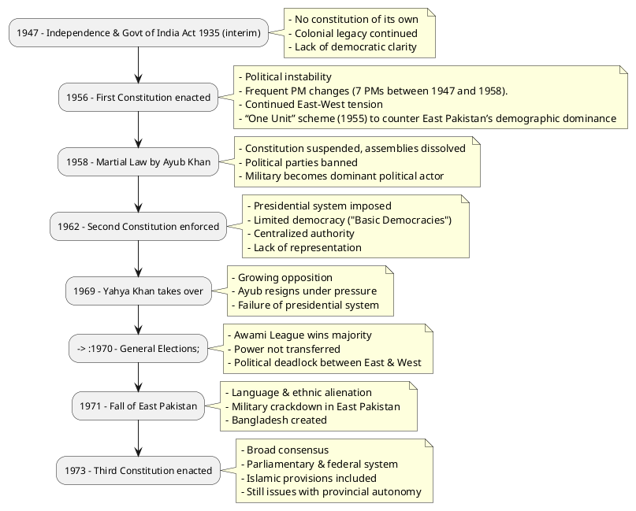

[[Pakistan Affairs]] [[history]] 

```plantuml
@startuml

:1947 - Independence & Govt of India Act 1935 (interim);
note right
- No constitution of its own  
- Colonial legacy continued  
- Lack of democratic clarity
end note

:1956 - First Constitution enacted;
note right
- Political instability   
- Frequent PM changes (7 PMs between 1947 and 1958). 
- Continued East-West tension
- “One Unit” scheme (1955) to counter East Pakistan’s demographic dominance
end note

:1958 - Martial Law by Ayub Khan;
note right
- Constitution suspended, assemblies dissolved 
- Political parties banned  
- Military becomes dominant political actor
end note

:1962 - Second Constitution enforced;
note right
- Presidential system imposed  
- Limited democracy ("Basic Democracies")  
- Centralized authority
- Lack of representation
end note

:1969 - Yahya Khan takes over;
note right
- Growing opposition  
- Ayub resigns under pressure  
- Failure of presidential system
end note

--> :1970 - General Elections;
note right
- Awami League wins majority  
- Power not transferred  
- Political deadlock between East & West
end note

:1971 - Fall of East Pakistan;
note right
- Language & ethnic alienation  
- Military crackdown in East Pakistan  
- Bangladesh created
end note

:1973 - Third Constitution enacted;
note right
- Broad consensus  
- Parliamentary & federal system  
- Islamic provisions included  
- Still issues with provincial autonomy
end note

@enduml

```

# References