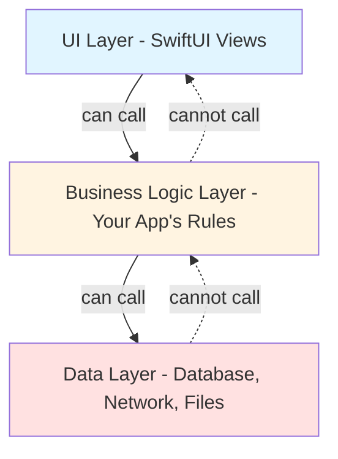
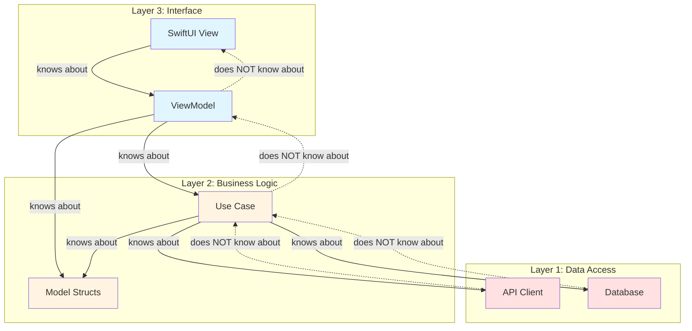
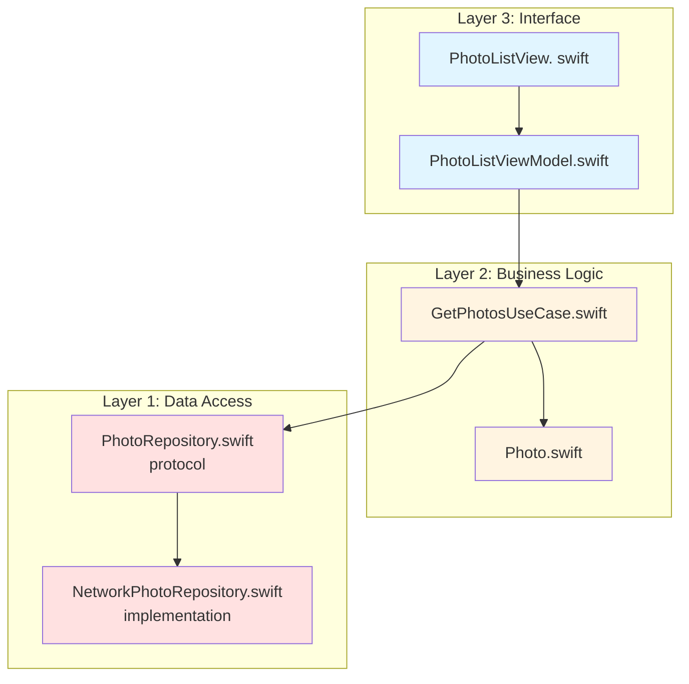
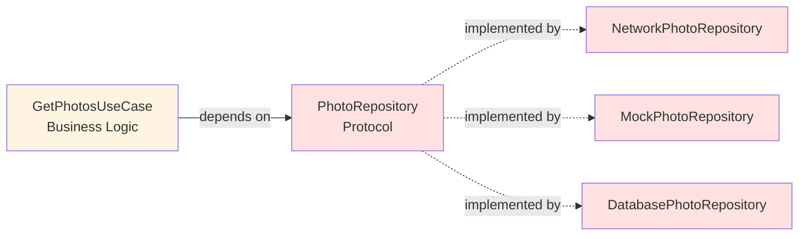
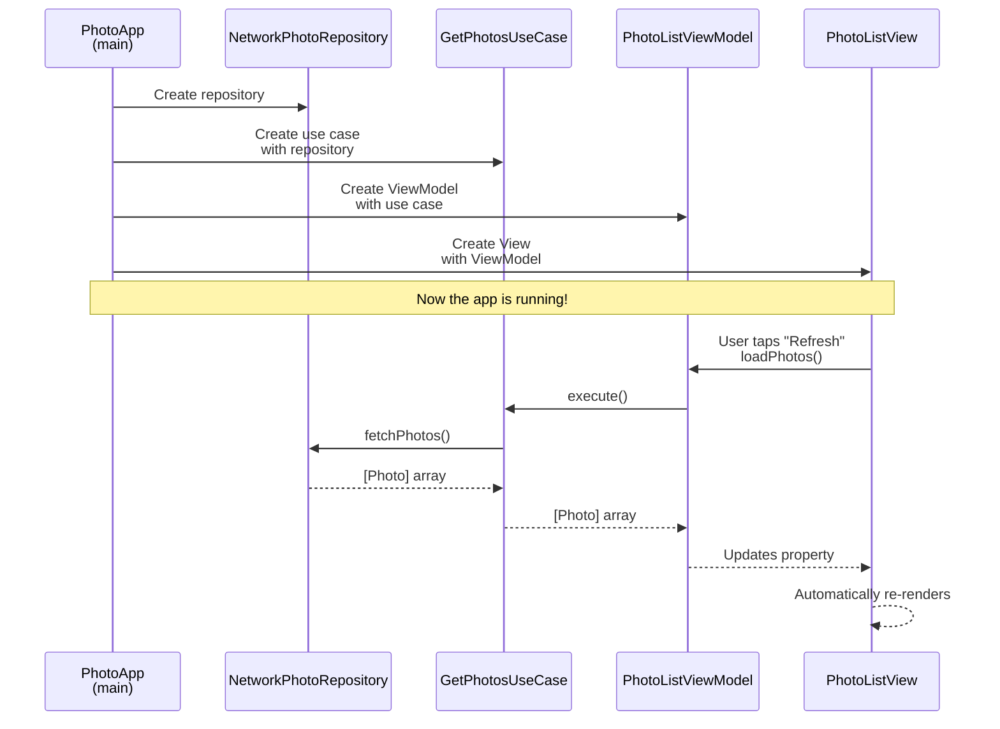

# Understanding the basic concepts of MVVM + Clean Architecture in Swift

Clean Architecture was created by Uncle Bob, the author of the book Clean Code. In Clean Code, he discusses writing readable, maintainable code at the function and class level. Clean Architecture is about organizing entire applications. It's like Clean Code, but zoomed out to the file and folder structure level.
## The Problem
When we write C programs, we might organize our code like this:

```
main.c           # Entry point
database.c       # Database operations
network.c        # Network operations
business_logic.c # Core algorithms
ui.c             # User interface
```

This might work for simple programs, but problems arise: 
1. What if we change the database from SQLite to PostgreSQL? 
2. What if we want to test `business_logic.c` without a real database?
3. What if UI code directly calls network functions? 

## The Solution
Clean Architecture solves this by creating **layers** with **strict rules about who can talk to whom**.



## Data Access Layer
Used to talk to external systems such as databases, APIs, and files.

**Examples:**
- Fetching JSON from a [[REST API]]
- Reading/writing SQLite
- Saving images to disk

> [!important]
> This layer only knows how to get data. 

## Business Logic Layer
The brain of our app, containing the app's rules.

**Examples:**
- A user can only save 100 photos in the free tier
- Photos must be compressed before uploading
- Calculate the total cost based on cart items

### Components
1. **Data Structures (Models)**

```swift
struct User {
    let id: Int
    let name:  String
    let email: String
}

struct Photo {
    let id: String
    let url:  URL
    let timestamp: Date
}
```

2. **Use Cases (Actions)**

A use case is **one thing a user wants to do**. 

**Examples:**
- Upload a photo
- Get list of all photos
- Delete a photo
- Login user

## Interface Layer
Handles UI and user interactions.

### Components
1. **Views**: What the users see and interact with
2. **ViewModels**: The middleman between views and business logic



# Example



## Data Access Layer: The Repository
Here, we first define what operations are available, but not how they work:

```swift
protocol PhotoRepository {
    // This function will get all photos from somewhere
    // We don't specify WHERE—that's the point!
    func fetchPhotos() async throws -> [Photo]
}
```

### Implementation
In the implementation, it actually fetches data from a network. 

```swift
import Foundation

class NetworkPhotoRepository:  PhotoRepository {
    
    func fetchPhotos() async throws -> [Photo] {
        // In a real app, you'd do this:  
        // 1. Create URLRequest
        // 2. Use URLSession to fetch data
        // 3. Parse JSON into Photo objects
        
        // Simulate network delay (like sleep() in C, but non-blocking)
        try await Task.sleep(nanoseconds: 1_000_000_000) // 1 second
        
        // Return dummy photos
        return [
            Photo(id: "1", title: "Sunset", url: "https://example.com/sunset.jpg"),
            Photo(id:  "2", title: "Mountain", url: "https://example.com/mountain.jpg"),
            Photo(id: "3", title:  "Ocean", url: "https://example.com/ocean.jpg")
        ]
    }
}
```

### Why Separate Protocol from Implementation?

1. **Testing**: You can create `MockPhotoRepository` for unit tests
2. **Flexibility**: Switch from API to database without changing business logic
3. **Dependency Inversion**: Business logic depends on the protocol (abstraction), not the concrete implementation



## Business Logic Layer: Models and Use Cases
The model is just a data structure with no dependencies:

```swift
import Foundation

struct Photo {
    let id: String
    let title:  String
    let url: String
}
```

### Use Cases
This represents one thing a user wants to do: get all photos in this case.

```swift
class GetPhotosUseCase {
    
    // This use case needs a repository to fetch data
    // We use the PROTOCOL, not a specific implementation
    private let repository: PhotoRepository
    
    init(repository: PhotoRepository) {
        self.repository = repository
    }
    
    // Execute the use case
    func execute() async throws -> [Photo] {
        // This is where business logic would go
        // For example: 
        // - Check if user is authenticated
        // - Filter out inappropriate photos
        // - Sort by date
        
        // For now, just fetch from repository
        let photos = try await repository.fetchPhotos()
        
        // Example business rule: Only return photos with titles
        let validPhotos = photos.filter { ! $0.title.isEmpty }
        
        return validPhotos
    }
}
```

## Interface Layer (MVVM): View and ViewModel

```swift
import Foundation

// @MainActor means "all code in this class runs on the main thread"
@MainActor
@Observable
class PhotoListViewModel {
    
    var photos: [Photo] = []
    var isLoading: Bool = false
    var errorMessage: String? = nil
    
    // The use case we'll call
    private let getPhotosUseCase: GetPhotosUseCase
    
    // Constructor - we pass in the use case
    init(getPhotosUseCase: GetPhotosUseCase) {
        self.getPhotosUseCase = getPhotosUseCase
    }
    
    // This function is called when user wants to load photos
    func loadPhotos() {
        isLoading = true
        errorMessage = nil
        
        // Task creates a new async context
        Task {
            do {
                // Call the use case
                let fetchedPhotos = try await getPhotosUseCase.execute()
                
                // Update the property
                // The View will automatically re-render
                self.photos = fetchedPhotos
                self. isLoading = false
                
            } catch {
                self. errorMessage = "Failed to load photos: \(error.localizedDescription)"
                self.isLoading = false
            }
        }
    }
}
```

> [!important] Why [[@MainActor]]?
> iOS apps have a **main thread** (like `main()` in C) that handles UI. You can't update UI from other threads.

```swift
import SwiftUI

struct PhotoListView: View {
    @State private var viewModel: PhotoListViewModel
    
    init(viewModel: PhotoListViewModel) {
        self.viewModel = viewModel
    }
    
    var body: some View {
        NavigationView {
            ZStack {
                List(viewModel.photos, id: \.id) { photo in
                    VStack(alignment: .leading) {
                        Text(photo.title)
                            .font(.headline)
                        Text(photo.url)
                            .font(.caption)
                            .foregroundColor(. gray)
                    }
                }
                
                if viewModel.isLoading {
                    ProgressView("Loading...")
                        .frame(maxWidth: . infinity, maxHeight: .infinity)
                        .background(Color. black.opacity(0.2))
                }
                
                if let errorMessage = viewModel.errorMessage {
                    VStack {
                        Spacer()
                        Text(errorMessage)
                            .foregroundColor(.red)
                            .padding()
                            .background(Color.white)
                            .cornerRadius(8)
                        Spacer()
                    }
                }
            }
            .navigationTitle("Photos")
            .toolbar {
                Button("Refresh") {
                    viewModel.loadPhotos()
                }
            }
        }
        .onAppear {
            viewModel.loadPhotos()
        }
    }
}
```

## Entry Point: Creating the Dependency Chain

```swift
import SwiftUI

// Like main() in C
@main
struct PhotoApp: App {
    var body: some Scene {
        WindowGroup {
            // 1. Create repository (Layer 1)
            let repository: PhotoRepository = NetworkPhotoRepository()
            
            // 2. Create use case with repository (Layer 2)
            let getPhotosUseCase = GetPhotosUseCase(repository: repository)
            
            // 3. Create ViewModel with use case (Layer 3)
            let viewModel = PhotoListViewModel(getPhotosUseCase: getPhotosUseCase)
            
            // 4. Create View with ViewModel (Layer 3)
            PhotoListView(viewModel: viewModel)
        }
    }
}
```

## Flow


